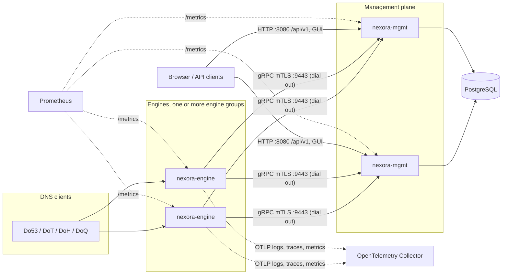
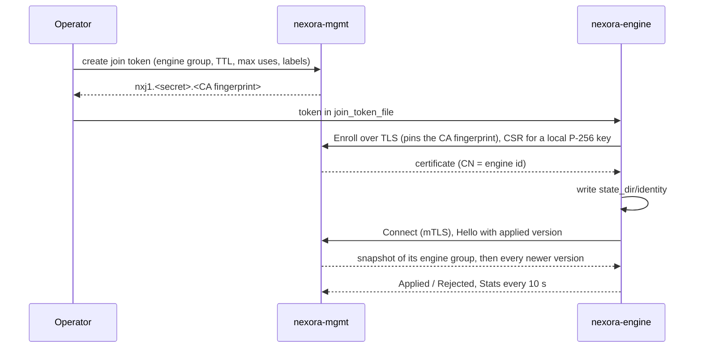

# Operating Nexora

This guide is for operators installing and running Nexora, from a single
homelab host to an ISP fleet. The design behind it is in
`docs/architecture.md`; this document covers the how-to.

- [Overview](#overview)
- [Install with Helm](#install-with-helm)
- [Install with Docker Compose](#install-with-docker-compose)
- [First-run setup and access](#first-run-setup-and-access)
- [Enrolling engines](#enrolling-engines)
- [Encrypted DNS: DoT, DoH and DoQ](#encrypted-dns-dot-doh-and-doq)
- [Key storage](#key-storage)
- [Upgrade](#upgrade)
- [Backup and restore PostgreSQL](#backup-and-restore-postgresql)
- [Engine groups and staged rollouts](#engine-groups-and-staged-rollouts)
- [Engine lifecycle](#engine-lifecycle)
- [Monitoring and alerts](#monitoring-and-alerts)
- [Performance tuning](#performance-tuning)
- [kw deployment](#kw-deployment)
- [Known limitations](#known-limitations)
- [Troubleshooting](#troubleshooting)

## Overview

Nexora has two binaries and a GUI:

- **`nexora-engine`** (Rust, Linux only) answers DNS. It dials out to the
  management plane, receives versioned configuration snapshots, stores the last
  one it applied in its state directory, and keeps serving from that snapshot
  when the management plane is unreachable. Query processing never touches a
  database or blocks on logging.
- **`nexora-mgmt`** (Go) is the management plane: HTTP API (`/api/v1`), the
  embedded React GUI, Prometheus metrics, and the gRPC control service engines
  connect to. It is stateless. Everything except in-memory query logs lives in
  PostgreSQL, so you can run any number of replicas behind a load balancer.
- **PostgreSQL** holds configuration, users, audit, engine records, rollouts
  and sealed secrets. Running PostgreSQL itself, including HA, is your job.



### Features

| Milestone | What you get                                                                                                                                                                                                                                                                       |
| --------- | ---------------------------------------------------------------------------------------------------------------------------------------------------------------------------------------------------------------------------------------------------------------------------------- |
| M1        | Forwarding over UDP, TCP, DoT and DoH upstreams (`ordered` or `fastest`), wire-format cache with serve-stale, blocklist subscriptions and allowlist, client ACL, Prometheus and OTLP telemetry, query log (built-in or OpenSearch), users, roles, API tokens, OIDC, audit, the GUI |
| M2        | DoT, DoH and DoQ listeners with certificates pushed over the control stream, per-client policy groups chosen by source CIDR, safe search, custom rewrites, PROXY v2 on DoT/DoH                                                                                                     |
| M3        | Iterative recursion from root hints, DNSSEC validation of recursive and forwarded answers (RFC 5011 trust anchors, negative trust anchors), forward zones, RPZ from files or AXFR/IXFR with TSIG                                                                                   |
| M4        | Authoritative primary and secondary zones, AXFR/IXFR out with ACLs and TSIG, NOTIFY, RFC 2136 dynamic updates, BIND zone file import and export, online DNSSEC signing with key rollovers and CDS/CDNSKEY, key storage under a key-encryption key or in a PKCS#11 HSM              |
| M5        | Engine groups with group-scoped configuration, canary rollouts with a health halt, rollback, fleet health, join tokens bound to groups, certificate renewal, rotation and revocation, release images, the Compose example and the Helm chart                                       |

### Ports

| Process         | Port           | Purpose                                                                          |
| --------------- | -------------- | -------------------------------------------------------------------------------- |
| `nexora-mgmt`   | 8080/TCP       | GUI, `/api/v1`, `/metrics` (`NEXORA_HTTP_LISTEN`)                                |
| `nexora-mgmt`   | 9443/TCP       | engine control (mTLS) and the built-in query-log receiver (`NEXORA_GRPC_LISTEN`) |
| `nexora-engine` | 53/UDP, 53/TCP | DNS (`listen_udp`, `listen_tcp`)                                                 |
| `nexora-engine` | 853/TCP        | DoT (`listen_dot`, off unless set)                                               |
| `nexora-engine` | 443/TCP        | DoH at `doh_path`, default `/dns-query` (`listen_doh`, off unless set)           |
| `nexora-engine` | 853/UDP        | DoQ (`listen_doq`, off unless set)                                               |
| `nexora-engine` | 9153/TCP       | `/metrics` (`metrics_listen`)                                                    |

### Management plane environment

`nexora-mgmt serve` reads only environment variables
(`mgmt/internal/config/config.go`). File-based secrets are passed as paths.

| Variable                                                                                     | Default                   | Notes                                                                                         |
| -------------------------------------------------------------------------------------------- | ------------------------- | --------------------------------------------------------------------------------------------- |
| `NEXORA_DATABASE_URL`                                                                        | required                  | PostgreSQL connection URL                                                                     |
| `NEXORA_CA_CERT_FILE`, `NEXORA_CA_KEY_FILE`                                                  | required                  | the engine CA (`nexora-mgmt ca init`)                                                         |
| `NEXORA_HTTP_LISTEN`                                                                         | `:8080`                   |                                                                                               |
| `NEXORA_GRPC_LISTEN`                                                                         | `:9443`                   |                                                                                               |
| `NEXORA_GRPC_SERVER_NAMES`                                                                   | empty                     | comma-separated names and IPs for the gRPC server certificate; must include what engines dial |
| `NEXORA_PUBLIC_URL`                                                                          | empty                     | external GUI URL, used for OIDC redirects (`<url>/api/v1/auth/oidc/callback`)                 |
| `NEXORA_SECURE_COOKIES`                                                                      | `true`                    | set `false` only for plain-HTTP test setups                                                   |
| `NEXORA_QUERYLOG_BACKEND`                                                                    | `builtin`                 | `builtin` or `opensearch`                                                                     |
| `NEXORA_QUERYLOG_BUILTIN_CAPACITY`                                                           | `200000`                  | records kept in memory per instance                                                           |
| `NEXORA_OPENSEARCH_URL`, `_INDEX`, `_USERNAME`, `_PASSWORD_FILE`                             | index `nexora-querylog-*` | URL required with `opensearch`                                                                |
| `NEXORA_OTLP_ENDPOINT`                                                                       | empty                     | OTLP gRPC endpoint handed to engines when the resolver settings and engine group set none     |
| `NEXORA_DNS_TLS_CERT_FILE`, `NEXORA_DNS_TLS_KEY_FILE`                                        | empty                     | DoT/DoH/DoQ certificate pushed to engines; both or neither                                    |
| `NEXORA_DNS_TLS_RELOAD_INTERVAL`                                                             | `30s`                     | minimum `1s`                                                                                  |
| `NEXORA_KEK_FILE`                                                                            | empty                     | base64 of 32 random bytes; see [Key storage](#key-storage)                                    |
| `NEXORA_PKCS11_MODULE`, `_TOKEN_LABEL`, `_PIN_FILE`                                          | empty                     | all three or none                                                                             |
| `NEXORA_OIDC_ISSUER`, `_CLIENT_ID`, `_CLIENT_SECRET_FILE`, `_ADMIN_GROUP`, `_OPERATOR_GROUP` | empty                     | client id and secret file required when the issuer is set                                     |
| `NEXORA_ENGINE_CERT_TTL`                                                                     | `2160h` (90 days)         | lifetime of issued engine certificates, minimum `30s`                                         |
| `NEXORA_ROLLOUT_TICK`                                                                        | `1s`                      | rollout controller tick, `100ms` to `1m`                                                      |
| `NEXORA_CATALOG_MIRROR`                                                                      | empty                     | base URL serving every catalog source at `<base>/<source key>` (air-gapped, tests); adds none |

Subcommands (`nexora-mgmt` with no arguments prints the usage):

```text
nexora-mgmt serve | version | migrate
nexora-mgmt ca init --out <dir> [--if-missing]
nexora-mgmt ca issue-dns --ca-cert F --ca-key F --names N[,N...] [--days 90] --out <dir>
nexora-mgmt user create --admin --username U --email E --password-file F
nexora-mgmt engine-group create --name N [--description D] [--if-missing]
nexora-mgmt join-token create --engine-group G [--name N] [--ttl 24h] [--max-uses N] [--label k=v]...
```

`migrate`, `user create`, `engine-group create` and `join-token create` need
`NEXORA_DATABASE_URL`; `join-token create` also needs `NEXORA_CA_CERT_FILE`,
because the token embeds the CA fingerprint. `serve` applies pending migrations
itself as well.

### Engine bootstrap file

The engine reads `engine.toml` (`nexora-engine --config /etc/nexora/engine.toml`).
Only host settings live there; everything else arrives in snapshots. The full
reference is in `docs/architecture.md`. The essentials:

```toml
node_name = "edge-1"                        # [a-z0-9-]{1,63}; NEXORA_ENGINE_NODE_NAME overrides it
state_dir = "/var/lib/nexora"
management_urls = ["https://mgmt.example.net:9443"]
join_token_file = "/etc/nexora/join-token"  # read only while state_dir/identity is missing
listen_udp = ["0.0.0.0:53"]
listen_tcp = ["0.0.0.0:53"]
metrics_listen = "0.0.0.0:9153"
workers = 0                                  # 0 = one per CPU
# listen_dot = ["0.0.0.0:853"]
# listen_doh = ["0.0.0.0:443"]
# listen_doq = ["0.0.0.0:853"]
```

## Install with Helm

The chart is `deploy/helm/nexora`. Every value is validated by
`deploy/helm/nexora/values.schema.json`; the defaults are in
`deploy/helm/nexora/values.yaml`.

Prerequisites:

- Kubernetes 1.28 or newer.
- PostgreSQL, one of:
  - the CloudNativePG operator, for `database.mode=cnpg` (the default). The
    chart creates a CNPG `Cluster` named `nexora-db` (2 instances, 10Gi,
    image `ghcr.io/cloudnative-pg/postgresql:17.6`) and reads the connection
    URL from the secret `nexora-db-app`, key `uri`. Rendering fails without the
    operator's API.
  - an existing database, for `database.mode=external`: a secret holding the
    connection URL (`database.external.existingSecret`, key
    `database.external.key`, default `uri`). Nexora is tested on PostgreSQL 17.
- Prometheus Operator CRDs, only when `metrics.serviceMonitor.enabled` or
  `metrics.prometheusRule.enabled` is set.

Resource names use a prefix: the release name when it contains `nexora`,
otherwise `<release>-nexora`. The commands below use release `nexora` in
namespace `nexora`, so the prefix is `nexora`.

1. Create the engine CA once and keep an offline copy. Losing it means
   re-enrolling every engine. From a checkout (or run the `nexora-mgmt` image
   with the same arguments):

   ```sh
   kubectl create namespace nexora
   go run ./mgmt/cmd/nexora-mgmt ca init --out ./nexora-ca
   kubectl -n nexora create secret generic nexora-ca \
     --from-file=ca.crt=./nexora-ca/ca.crt --from-file=ca.key=./nexora-ca/ca.key
   ```

   Optionally create now:
   - a key-encryption key for TSIG keys, RPZ TSIG secrets and DNSSEC keys
     (`mgmt.kek.existingSecret`):
     `openssl rand -base64 32 | kubectl -n nexora create secret generic nexora-kek --from-file=kek=/dev/stdin`
   - a `kubernetes.io/tls` secret for DoT/DoH/DoQ (`mgmt.dnsTLS.existingSecret`),
     see [Encrypted DNS](#encrypted-dns-dot-doh-and-doq).
   - for `database.mode=external`:
     `kubectl -n nexora create secret generic nexora-db --from-literal=uri='postgres://nexora:<password>@db.example.net:5432/nexora?sslmode=require'`

2. Install the management plane without engines (engine workloads need join
   token secrets, which need the management plane):

   ```sh
   helm upgrade --install nexora deploy/helm/nexora -n nexora \
     --set image.registry=<registry> --set image.tag=<tag> \
     --set mgmt.ca.existingSecret=nexora-ca \
     --set engine.enabled=false --wait
   ```

   `image.registry` defaults to the project's own registry; the images are
   `<registry>/nexora-mgmt:<tag>` and `<registry>/nexora-engine:<tag>`, and the
   tag defaults to the chart's `appVersion`. Expose the GUI with
   `mgmt.ingress.*` (TLS with `mgmt.ingress.clusterIssuer` for cert-manager) and
   set `mgmt.publicURL` to its URL.

3. Complete first-run setup, see
   [First-run setup and access](#first-run-setup-and-access).

4. Create engine groups and join token secrets, see
   [Enrolling engines](#enrolling-engines).

5. Describe the engine workloads in `engine.groups` and upgrade without
   `engine.enabled=false`:

   ```yaml
   engine:
     kind: DaemonSet # or Deployment (groups[].replicas)
     workers: 2
     ports: { dns: 53, metrics: 9153, dot: 853, doh: 443, doq: 853 } # 0 disables an encrypted listener
     stateDir: { type: hostPath, hostPathPrefix: /var/lib/nexora }
     groups:
       - name: default
         joinTokenSecret: nexora-join-default
         service:
           {
             type: LoadBalancer,
             loadBalancerIP: 192.0.2.53,
             externalTrafficPolicy: Local,
           }
       - name: edge
         nodeNamePrefix: edge-
         joinTokenSecret: nexora-join-edge
         nodeAffinity:
           requiredDuringSchedulingIgnoredDuringExecution:
             nodeSelectorTerms:
               - matchExpressions:
                   - {
                       key: nexora.io/engine-group,
                       operator: In,
                       values: [edge],
                     }
   ```

   Each group gets its own workload (`<prefix>-engine-<name>` unless
   `workloadName` is set), ConfigMap with `engine.toml`, and DNS Service
   (`<prefix>-dns-<name>` unless `service.name` is set). The Service exposes 53,
   and 853/TCP, 853/UDP and 443/TCP for the encrypted listeners that are
   enabled. `groups[].name` in the chart only names the workload; the engine
   group an engine joins comes from its join token.

What the chart sets up:

- **Management plane**: Deployment `<prefix>-mgmt` (`mgmt.replicas`, default
  2, spread across nodes), a `migrate` init container, readiness on
  `/api/v1/health`, a PodDisruptionBudget (`minAvailable: 1`) when replicas
  exceed 1, Service `<prefix>-mgmt` (8080) and Service `<prefix>-mgmt-grpc`
  (9443). `mgmt.grpcLoadBalancer.enabled` adds a gRPC-only LoadBalancer for
  engines outside the cluster; its IP is added to the server certificate.
  Extra certificate names go in `mgmt.grpcServerNames`. Extra environment
  (OIDC, OpenSearch credentials) goes in `mgmt.extraEnv`, `mgmt.extraVolumes`
  and `mgmt.extraVolumeMounts`.
- **Engines** dial `https://<prefix>-mgmt-grpc.<namespace>.svc.cluster.local:9443`
  unless `engine.managementURL` is set. The engine name is
  `<nodeNamePrefix><Kubernetes node name>`, so a restarted pod keeps its
  identity. Pods run as uid 10001 with the namespaced sysctl
  `net.ipv4.ip_unprivileged_port_start=0` to bind port 53.
- **Engine state**: `engine.stateDir.type=hostPath` (default) keeps identity,
  snapshot and caches in `<hostPathPrefix>/<workload>` on the node across pod
  restarts. `emptyDir` enrolls a new engine after every pod restart and needs
  a join token that is still valid.
- **Client addresses**: DNS Services default to `externalTrafficPolicy: Local`,
  so engines see real client IPs (needed by per-client policy and the query
  log). The node that announces the LoadBalancer address must then run an
  engine of that group. `Cluster` works everywhere but engines see node
  addresses.
- **`engine.hostNetwork: true`** binds the engine ports on the node. The pod
  can no longer set the sysctl, so the node's
  `net.ipv4.ip_unprivileged_port_start` must be at or below the lowest engine
  port, and two engine groups must not share a node.
- **Optional**: `otelCollector.enabled` deploys an OpenTelemetry Collector
  (`<prefix>-otelcol`) and points `NEXORA_OTLP_ENDPOINT` at it when
  `mgmt.otlpEndpoint` is empty; `metrics.serviceMonitor` and
  `metrics.prometheusRule`, see [Monitoring and alerts](#monitoring-and-alerts).

## Install with Docker Compose

`deploy/compose` runs PostgreSQL 17, a one-shot CA initialiser, migrations, one
management plane, one engine (profile `engine`) and an optional OpenTelemetry
Collector (profile `otel`). It suits a single host. The engine is Linux only.

```sh
cd deploy/compose
cp .env.example .env                                   # set NEXORA_TAG (and NEXORA_REGISTRY)
openssl rand -hex 24 > secrets/postgres-password
printf 'postgres:5432:nexora:nexora:%s\n' "$(cat secrets/postgres-password)" > secrets/pgpass
chmod 0644 secrets/postgres-password secrets/pgpass    # read by the postgres and nexora-mgmt users
docker compose up -d                                   # postgres, CA, migrations, mgmt
docker compose logs mgmt | grep "setup token"          # complete /setup at NEXORA_PUBLIC_URL
docker compose run --rm -T mgmt join-token create --engine-group default --ttl 1h > secrets/join-token
docker compose --profile engine up -d
docker compose --profile otel up -d                    # optional collector (otel-collector.yaml)
```

- `.env` settings: `NEXORA_TAG`, `NEXORA_REGISTRY`, `NEXORA_PUBLIC_URL`
  (default `http://localhost:8080`), `NEXORA_PUBLIC_HOST` (added to the gRPC
  certificate), `NEXORA_SECURE_COOKIES` (`false` because the example serves
  plain HTTP; set `true` behind an HTTPS reverse proxy),
  `NEXORA_DNS_PORT`, `NEXORA_HTTP_PORT`, `NEXORA_GRPC_PORT`,
  `NEXORA_METRICS_PORT`, `NEXORA_ENGINE_NODE_NAME`, `NEXORA_OTLP_ENDPOINT`
  (for the bundled collector: `http://otel-collector:4317`).
- The CA lives in the volume `ca`, the database in `pgdata`, the engine state
  in `enginestate`. Back up `ca` together with the database.
- The collector in `deploy/compose/otel-collector.yaml` only prints what it
  receives (`debug` exporter). Replace the exporters to send data to a real
  backend.
- Engines on other hosts use the same `engine.toml` with
  `management_urls = ["https://<NEXORA_PUBLIC_HOST>:9443"]`, a unique
  `node_name` and their own join token.
- The example is checked statically (`TestComposeExample`); it is not started
  in CI.

## First-run setup and access

When the database has no users, the first management instance to start logs a
one-time token once:

```text
2026/09/14 10:00:00 setup token: <token>
```

Open `<public URL>/setup`, enter the token and create the first admin. A new
install is in forward mode with no upstreams, so add upstreams under
`/upstreams` (or switch the resolution mode to recursive there) before
expecting answers. With
several replicas only one pod logs it:

```sh
kubectl -n nexora logs -l app.kubernetes.io/name=nexora-mgmt -c mgmt --tail=-1 | grep "setup token"
```

Without an ingress, `kubectl -n nexora port-forward svc/nexora-mgmt 8080:8080`
and open `http://localhost:8080/setup`. The token is logged only when it is
created; if that log is gone, create the admin directly:

```sh
kubectl -n nexora exec -i deploy/nexora-mgmt -c mgmt -- /nexora-mgmt user create --admin \
  --username admin --email admin@example.net --password-file /dev/stdin < admin-password.txt
# Compose
docker compose run --rm -T mgmt user create --admin \
  --username admin --email admin@example.net --password-file /dev/stdin < admin-password.txt
```

Access control:

- Roles: `viewer` (reads everything except users, tokens and audit),
  `operator` (also changes DNS configuration), `admin` (everything).
- API clients use bearer tokens (`Authorization: Bearer nxt_...`) created under
  `/api-tokens` or `POST /api/v1/api-tokens` with a name and role. Mutating
  requests must send `Content-Type: application/json`.
- OIDC login: set `NEXORA_OIDC_ISSUER`, `NEXORA_OIDC_CLIENT_ID`,
  `NEXORA_OIDC_CLIENT_SECRET_FILE`, optionally the admin and operator group
  names, and register `<NEXORA_PUBLIC_URL>/api/v1/auth/oidc/callback` with the
  identity provider.
- Every change is recorded in the audit log (`/audit`).

## Enrolling engines



1. Pick or create the engine group. The group `default` always exists. In the
   GUI use `/engines`; with the API `POST /api/v1/engine-groups`; from a mgmt
   container `nexora-mgmt engine-group create --name edge --if-missing`.
2. Create a join token for the group:
   - GUI: `/engines`, join tokens.
   - API: `POST /api/v1/join-tokens` with `name`, `ttl_seconds` (60 to
     31536000), optionally `engine_group_id`, `max_uses` and `labels`. The
     token is returned once.
   - CLI (prints only the token):

     ```sh
     kubectl -n nexora exec deploy/nexora-mgmt -c mgmt -- /nexora-mgmt join-token create \
       --engine-group edge --ttl 8760h --label nexora.io/canary=true \
       | kubectl -n nexora create secret generic nexora-join-edge --from-file=join-token=/dev/stdin
     ```

     `--ttl` accepts `1m` to `8760h`; `--max-uses` 0 (the default) means
     unlimited.
3. Put the token where the engine reads `join_token_file`. In the chart that is
   the secret `groups[].joinTokenSecret`, key `groups[].joinTokenKey` (default
   `join-token`).

A token without a use limit can enroll every pod of a DaemonSet or an
autoscaled Deployment. An enrolled engine never needs the token again, because
its identity is in `state_dir/identity`. Enrolling always creates a new engine
record, even when the node name matches an older one; delete the stale record
under `/engines`. Labels from the token are copied to the engine and can be
changed later (`PATCH /api/v1/engines/{id}` or the engine page), which is also
how an engine moves to another group.

## Encrypted DNS: DoT, DoH and DoQ

Engines never read certificate files in managed mode. The management plane
loads one serving certificate and key from `NEXORA_DNS_TLS_CERT_FILE` and
`NEXORA_DNS_TLS_KEY_FILE`, re-reads them every `NEXORA_DNS_TLS_RELOAD_INTERVAL`
and pushes them to every engine over the control stream. Engines keep the key
in memory only. Rotating the files (or the Kubernetes secret, which the kubelet
updates in place) rotates the certificate without restarts.

1. Get a certificate whose names cover what clients dial (host names and IP
   addresses). Any `kubernetes.io/tls` secret works, for example from
   cert-manager, or issue one from the Nexora CA (clients must then trust that
   CA):

   ```sh
   go run ./mgmt/cmd/nexora-mgmt ca issue-dns --ca-cert ./nexora-ca/ca.crt --ca-key ./nexora-ca/ca.key \
     --names dns.example.net,192.0.2.53 --days 90 --out ./dns-tls
   kubectl -n nexora create secret tls nexora-dns-tls --cert=./dns-tls/tls.crt --key=./dns-tls/tls.key
   ```

2. Helm: `mgmt.dnsTLS.existingSecret=nexora-dns-tls` and non-zero
   `engine.ports.dot`, `engine.ports.doh`, `engine.ports.doq`. Elsewhere: set
   the two variables on every mgmt instance and add `listen_dot`, `listen_doh`
   and `listen_doq` to `engine.toml`.
3. Check `GET /api/v1/settings/dns-tls` (the TLS section of `/settings`) for the
   loaded certificate, and `nexora_tls_certificate_not_after_seconds` on the
   engines.

Behind a TCP load balancer that sends PROXY v2 headers, set
`proxy_protocol_dot` or `proxy_protocol_doh` with
`proxy_protocol_trusted_cidrs` in `engine.toml`, so the engine sees the real
client address. Rejections are counted in
`nexora_proxy_protocol_rejected_total`.

## Key storage

TSIG keys, RPZ TSIG secrets and DNSSEC private keys are never stored in
plaintext. Without a key backend, the management plane logs
`key storage: none configured; RPZ TSIG secrets, TSIG keys and DNSSEC signing are refused`
and refuses those features.

- **Key-encryption key file** (`NEXORA_KEK_FILE`, Helm `mgmt.kek.existingSecret`,
  key `kek`): 32 random bytes, base64 (`openssl rand -base64 32`). Secrets are
  sealed with AES-256-GCM and stored in PostgreSQL. The file must not be
  readable by other users (mode `0600`, or `0440` with the process's group, as
  Kubernetes secret volumes with `fsGroup` present it). Every mgmt instance
  needs the same key. Losing it makes the sealed secrets unreadable, and a
  database backup is useless without it, so back it up separately.
- **PKCS#11 HSM** (`NEXORA_PKCS11_MODULE`, `NEXORA_PKCS11_TOKEN_LABEL`,
  `NEXORA_PKCS11_PIN_FILE`, all three): new DNSSEC keys are created inside the
  token and an envelope wrap key is created there on first start. PKCS#11
  modules are C shared libraries, so `nexora-mgmt` must be built with cgo
  (`CGO_ENABLED=1`). A build without cgo fails at start with
  `this nexora-mgmt build has no PKCS#11 support (built with CGO_ENABLED=0)`.
  The release image (`deploy/docker/mgmt.Dockerfile`) is built with cgo on
  Debian trixie (glibc) and ships no module: mount the vendor's module, built
  for glibc on the image's architecture, plus its configuration, and put the
  PIN in a secret. Keep `NEXORA_KEK_FILE` set if KEK-sealed secrets already
  exist, so they stay readable. DNSSEC key objects are labelled
  `nexora-dnssec:<installation id>` (the id lives in the `installation` table),
  and the clean-up of keys left by failed transactions (unreferenced for an
  hour) only destroys
  objects with its own label, so separate installations may share a token.
  A database restored into a second installation carries the same id: give
  that installation its own token (or partition).

## Upgrade

1. Back up PostgreSQL, the CA and the KEK (next section).
2. `helm upgrade` with the new `image.tag` (Compose: change `NEXORA_TAG` and
   `docker compose up -d`). Every mgmt pod runs `nexora-mgmt migrate` in its
   init container, and `serve` migrates again on start. Migrations take the
   PostgreSQL advisory lock `hashtext('nexora:migrate')`, so instances never
   migrate concurrently. Management pods roll with the PodDisruptionBudget
   (`minAvailable: 1`); engines keep serving and reconnect to a surviving
   instance.
3. Engine workloads roll one pod at a time (`maxUnavailable: 1`; a Deployment
   also uses `maxSurge: 0`, so two pods never share a hostPath state
   directory). With hostPath state a restarted engine keeps its identity and
   last snapshot. With `externalTrafficPolicy: Local`, queries sent to a node
   are dropped while that node's engine restarts.
4. Check `/engines` (every engine `current`), `nexora_mgmt_engines_disconnected`
   and `GET /api/v1/health`, which reports the running version.

Migrations are forward-only (`mgmt/migrations`). To go back past one, restore
the pre-upgrade backup with the previous image.

## Backup and restore PostgreSQL

### What state lives where

| State                                                                                                         | Where                                    | Back up?                                           |
| ------------------------------------------------------------------------------------------------------------- | ---------------------------------------- | -------------------------------------------------- |
| Configuration, versions and snapshots, users, API tokens, audit, engine records, rollouts, zones, sealed keys | PostgreSQL                               | yes, on a schedule and before upgrades             |
| Engine CA (`ca.crt`, `ca.key`)                                                                                | secret `nexora-ca` / Compose volume `ca` | yes, offline; losing it means re-enrolling engines |
| Key-encryption key                                                                                            | secret `nexora-kek` / file               | yes, separately from the database                  |
| HSM keys                                                                                                      | the PKCS#11 token                        | per the HSM vendor                                 |
| DNS serving certificate, OIDC client secret, OpenSearch password                                              | files or secrets you provide             | as your certificate process requires               |
| Built-in query log                                                                                            | memory of each mgmt instance             | not persisted                                      |
| Engine identity and last snapshot                                                                             | engine `state_dir`                       | optional; a lost state dir means enrolling again   |

The engine `state_dir` contains `identity/` (`cert.pem`, `key.pem`, `ca.pem`,
`engine_id`; `identity.new` and `identity.old` appear briefly during
certificate renewal), `snapshot.binpb` (the last applied snapshot), `blobs/`
(block lists, RPZ files, zone images), `trust-anchors.json` (RFC 5011 state)
and `rpz/<zone id>.zone` (last good transferred RPZ zones). The DNS serving
certificate and TSIG secrets are never written there.

### CloudNativePG

For continuous backups configure `spec.backup.barmanObjectStore` on the CNPG
cluster and a `ScheduledBackup` (see the CNPG documentation). For a logical
dump:

```sh
primary=$(kubectl -n nexora get cluster nexora-db -o jsonpath='{.status.currentPrimary}')
kubectl -n nexora exec "$primary" -c postgres -- pg_dump -Fc -d nexora > nexora-backup.dump
```

Restore with the management plane stopped:

```sh
kubectl -n nexora scale deploy/nexora-mgmt --replicas=0
kubectl -n nexora exec -i "$primary" -c postgres -- pg_restore --clean --if-exists -d nexora < nexora-backup.dump
kubectl -n nexora scale deploy/nexora-mgmt --replicas=2
```

### Plain PostgreSQL and Compose

```sh
pg_dump -Fc -d "$NEXORA_DATABASE_URL" > nexora-backup.dump
pg_restore --clean --if-exists -d "$NEXORA_DATABASE_URL" nexora-backup.dump   # with every mgmt instance stopped

# Compose
docker compose exec -T postgres pg_dump -U nexora -Fc nexora > nexora-backup.dump
docker compose stop mgmt
docker compose exec -T postgres pg_restore -U nexora --clean --if-exists -d nexora < nexora-backup.dump
docker compose start mgmt
```

### Engines ahead of a restored database

Engines only apply versions newer than the one they run, so an engine that
applied a version above the restored database's newest version is flagged
`ahead` and is not downgraded. It keeps serving what it has. Versions are one
global sequence (each publish is the newest version plus one), so publish until
the newest version exceeds the highest `nexora_config_version` the engines
report. Resuming rollouts publishes one version, and it needs the group paused:

```sh
# as many times as needed, until GET /api/v1/config-versions?limit=1 is above the engines' version
psql "$NEXORA_DATABASE_URL" -c "update engine_groups set rollouts_paused = true where name = 'default';"
curl -fsS -X POST -H "Authorization: Bearer $NEXORA_TOKEN" \
  https://nexora.example.net/api/v1/engine-groups/00000000-0000-0000-0000-000000000001/resume-rollouts
```

Any configuration change also publishes a version. `ahead` engines return to
`current` once their group's version is above theirs.

## Engine groups and staged rollouts

- Every engine is in exactly one engine group. Upstreams, filter lists, policy
  groups, global rewrites, forward zones, zones and RPZ zones apply either to
  every group or to one: the "Engine group" field in the GUI,
  `engine_group_id` in the API (null means all groups). Names stay unique
  across the fleet. Engine groups are server-side; policy groups still select
  clients by source address.
- Per group you can also set `upstream_mode` (`inherit`: the group's upstreams
  first, then the global ones; `override`: only the group's), `extra_acl_cidrs`
  (appended to the global allow list) and `otlp_endpoint` (replaces the global
  one). Resolution, DNSSEC, cache, block mode, allowlist and safe-search
  settings are fleet-wide.
- Every change publishes one version with a snapshot per engine group. A group
  whose content did not change applies it at once.
- Group rollout parameters (`PUT /api/v1/engine-groups/{id}` or the group page):
  `rollout_strategy` (`all_at_once` or `canary`), `canary_count`,
  `canary_percent`, `ack_timeout_seconds` (default 60), `health_window_seconds`
  (30), `max_servfail_ratio` (0.05), `min_health_queries` (100).

```mermaid
stateDiagram-v2
  [*] --> pending: canary change
  [*] --> rolling: all_at_once, rollback, republish
  pending --> canary: canaries selected
  canary --> verifying: all canaries applied
  verifying --> rolling: health window passed
  rolling --> completed: every connected engine applied
  canary --> halted: rejection or ack timeout
  verifying --> halted: SERVFAIL ratio or canary stopped reporting
  rolling --> halted: rejection or ack timeout
  halted --> rolled_back: rollback
  pending --> superseded: newer change
  canary --> superseded
  verifying --> superseded
  rolling --> superseded
  halted --> superseded
  completed --> [*]
```



How a canary rollout runs:

1. Canary selection waits while the group's rollouts are paused. It picks
   connected engines, those labelled `nexora.io/canary=true` first, then by
   node name: max(`canary_count`, `canary_percent`% of connected engines), at
   least one and, with two or more connected, at most all but one.
2. Canaries must apply the version within `ack_timeout_seconds`.
3. For `health_window_seconds` their stats are watched. A canary that stops
   reporting halts the rollout. With at least `min_health_queries` queries, a
   SERVFAIL ratio above `max_servfail_ratio` halts it.
4. The rest of the group then receives the version and must apply it within
   `ack_timeout_seconds`. Disconnected engines get it when they reconnect.

When a rollout halts, the canaries keep the new version, everyone else stays on
the group's stable version, and `NexoraRolloutHalted` fires. The halt reason is
on the rollout page (`/engines/rollouts/<id>`, `GET /api/v1/rollouts/{id}`,
which also lists each engine's progress). Then either:

- **Fix forward**: make another change. It supersedes the halted rollout.
- **Roll back**: "Roll back" on `/engines/groups/<id>`, or
  `POST /api/v1/engine-groups/{id}/rollback` with `{"to_version": N}`. The
  rollback republishes version N's group snapshot as a new version to the
  whole group at once and pauses change rollouts for the group, because the
  configuration rows still contain the rolled-back change. Correct the
  configuration, then "Resume rollouts" (`POST /api/v1/engine-groups/{id}/resume-rollouts`),
  which publishes a fresh version. While paused, new changes wait in `pending`.

Moving an engine to another group republishes that group's stable snapshot as a
new version. `GET /api/v1/rollouts?engine_group_id=<id>&state=halted` lists
rollouts by group and state; `GET /api/v1/fleet/summary` gives the counts shown
on `/engines`.

## Engine lifecycle

Engine status, shown on `/engines` and exported as
`nexora_mgmt_engines{engine_group,status}`:

| Status         | Meaning                                                                                 |
| -------------- | --------------------------------------------------------------------------------------- |
| `current`      | applied its target version                                                              |
| `behind`       | connected, not yet on its target version                                                |
| `rejected`     | rejected a newer version; the reason is on the engine page                              |
| `disconnected` | no live control stream (or its management instance stopped heartbeating for 15 s)       |
| `ahead`        | runs a version above its target, for example after a database restore; never downgraded |
| `revoked`      | revoked; still serving its last snapshot                                                |

- **Join tokens** carry the engine group, labels, an expiry and optionally a
  use limit. Revoke unused tokens under `/engines` or
  `DELETE /api/v1/join-tokens/{id}`.
- **Renewal**: engine certificates live for `NEXORA_ENGINE_CERT_TTL` (Helm
  `mgmt.engineCertTTL`, default 90 days). From two thirds of the lifetime the
  engine requests a new certificate over its control stream with a new key,
  swaps `state_dir/identity` atomically once the new certificate works, and
  reconnects. `nexora_control_cert_renewals_total` counts renewals. An engine
  that stays disconnected past its certificate's expiry cannot reconnect and
  must be enrolled again.
- **Rotation**: "Rotate certificate" on the engine page
  (`POST /api/v1/engines/{id}/rotate-certificate`) makes the engine renew now.
  The old serial is marked superseded when the engine reconnects with the new
  one.
- **Revocation**: "Revoke" (`POST /api/v1/engines/{id}/revoke`) revokes all of
  the engine's certificates and ends its streams on every management instance
  at once. The engine keeps serving its last configuration, sets
  `nexora_control_revoked 1` and retries every 300 seconds (±10%). To admit the
  host again, remove its state directory (with the chart's hostPath:
  `<hostPathPrefix>/<workload>` on that node) and give it a valid join token;
  it enrolls as a new engine.
- **Delete** (`DELETE /api/v1/engines/{id}`) revokes the engine and removes it
  from the fleet view.

## Monitoring and alerts

### Prometheus

- The management plane serves `/metrics` on its HTTP port (8080), engines on
  `metrics_listen` (9153). The chart labels the Services `<prefix>-mgmt` and
  `<prefix>-engine-metrics` with `nexora.io/metrics: "true"`, and
  `metrics.serviceMonitor.enabled` scrapes both (set
  `metrics.serviceMonitor.labels` to match your Prometheus selector, for
  example `release: kps`).
- Management metrics: `nexora_mgmt_engines{engine_group,status}`,
  `nexora_mgmt_engines_disconnected`, `nexora_mgmt_rollouts{engine_group,state}`,
  `nexora_mgmt_config_version`, `nexora_mgmt_filter_list_stale{list}`,
  `nexora_mgmt_filter_list_last_success_timestamp_seconds{list}`,
  `nexora_mgmt_http_requests_total`, `nexora_mgmt_http_request_duration_seconds`,
  `nexora_mgmt_dns_tls_reload_errors_total`,
  `nexora_mgmt_dns_tls_not_after_seconds`, `nexora_mgmt_notify_ignored_total`.
  Fleet metrics are read from PostgreSQL at scrape time, so every instance
  reports the same values.
- Engine metrics (a selection): `nexora_queries_total{transport,rcode}`,
  `nexora_query_duration_seconds`, `nexora_cache_hits_total`,
  `nexora_cache_misses_total`, `nexora_cache_bytes`, `nexora_upstream_up{upstream}`,
  `nexora_upstream_rtt_seconds{upstream}`, `nexora_filter_blocked_total`,
  `nexora_export_dropped_total{signal}`, `nexora_config_version`,
  `nexora_control_connected`, `nexora_control_revoked`,
  `nexora_control_cert_renewals_total`, `nexora_tls_handshakes_total`,
  `nexora_tls_certificate_not_after_seconds`, `nexora_dnssec_bogus_total`,
  `nexora_rpz_zone_stale`, `nexora_auth_transfers_total`. The full list is in
  `docs/architecture.md` and `engine/src/telemetry/metrics.rs`.

### Alerts

`metrics.prometheusRule.enabled` installs these rules (group `nexora-fleet`):

| Alert                       | Condition                                                                                     | Severity |
| --------------------------- | --------------------------------------------------------------------------------------------- | -------- |
| `NexoraEngineDisconnected`  | `nexora_mgmt_engines_disconnected > 0` for 2 minutes (engines without a stream for over 60 s) | warning  |
| `NexoraRolloutHalted`       | a rollout in state `halted`                                                                   | warning  |
| `NexoraManagementPlaneDown` | no mgmt instance scraped as up for 2 minutes                                                  | critical |

Other useful signals: `nexora_mgmt_filter_list_stale == 1`,
`nexora_tls_certificate_not_after_seconds - time() < 14*86400`,
`increase(nexora_export_dropped_total[5m]) > 0`, `nexora_upstream_up == 0`.

### Query logs, traces and OTLP

- **Built-in query log** (`NEXORA_QUERYLOG_BACKEND=builtin`): engines send query
  log records over their mTLS connection to the management instance they are
  connected to, which keeps the newest `NEXORA_QUERYLOG_BUILTIN_CAPACITY`
  records in memory. Each instance only sees its own engines' records and
  loses them on restart, so it suits single-instance installs.
- **OpenSearch** (`opensearch`): engines send OTLP logs to an OpenTelemetry
  Collector whose `opensearch` exporter writes daily indices
  `nexora-querylog-YYYY.MM.DD`; the management plane searches
  `NEXORA_OPENSEARCH_INDEX` (default `nexora-querylog-*`). `deploy/kw/otelcol.yaml`
  is a working collector configuration (logs to OpenSearch, traces to Jaeger).
- **OTLP endpoint** for engines: the group's `otlp_endpoint`, else the
  resolver settings' `otlp_endpoint` (`/settings`, `PUT /api/v1/resolver-settings`),
  else `NEXORA_OTLP_ENDPOINT`. Engines push OTLP metrics every 15 seconds and
  traces there. An unreachable endpoint drops data and counts it in
  `nexora_export_dropped_total`; it never slows queries.
- **Traces**: a query becomes a trace when `trace_sample_one_in` selects it
  (0, the default, samples none), when it takes longer than
  `trace_slow_threshold_us` (default 100000, 100 ms), or when it ends in
  SERVFAIL. Spans: `dns.query` with `nexora.filter`, `nexora.cache` and
  `nexora.upstream`.

## Performance tuning

- **Workers**: `workers` in `engine.toml` (0 = one per CPU; the chart sets
  `engine.workers`, default 2). Each worker owns `SO_REUSEPORT` sockets, so
  keep workers at or below the CPUs the engine may use and raise
  `engine.resources.limits.cpu` (default 2) together with it.
- **Cache**: `cache_max_bytes` in the resolver settings (`/settings`, default 256 MiB,
  minimum 1 MiB), plus `cache_min_ttl`, `cache_max_ttl`,
  `cache_negative_max_ttl` and `cache_stale_window`. Raise the engine memory
  limit (chart default 1Gi) above the cache size. Watch
  `nexora_cache_hits_total` against `nexora_cache_misses_total`. Changing
  filter lists, policy groups, upstreams or resolution settings clears the
  cache; zone edits do not.
- **Upstreams**: `fastest` chooses by measured RTT; per-upstream `timeout_ms`
  (default 250) bounds each attempt.
- **Networking**: `engine.hostNetwork` removes the pod network hop. Keep
  `externalTrafficPolicy: Local` so client addresses survive and traffic is
  not forwarded between nodes.
- **Telemetry**: keep `trace_sample_one_in` at 0 or a large value on busy
  engines. The query log queue holds 65536 records per engine; overflow is
  dropped, never queued against the query path.

The perf gate (`.github/workflows/perf-gate.yml`, tool in `bench/cmd/perfgate`):

- On pull requests that touch the engine, base and head engines run nine
  interleaved 15-second dnsperf rounds against the fixture upstream on the
  same runner, and the gate fails when the median head/base ratio drops QPS by
  more than 5%.
- Nightly and on release tags, an absolute gate on a reference box (8-core
  x86_64, 10GbE) requires at least 1,000,000 QPS and p99 below 500 µs. It is
  skipped until `NEXORA_REFERENCE_HOST` is configured.
- Locally, `scripts/dev-exec.sh make bench` builds the engine, fixture and
  perfgate and writes `bin/perf.json`. Compare runs on the same machine only;
  a loaded shared machine is too noisy for small differences.

## Filter categories

- **Catalog**: the category catalog (`mgmt/internal/catalog/catalog.yaml`) is
  embedded in `nexora-mgmt`, read-only, and ships with releases; every
  instance syncs it into the database at start. Categories are off after
  install. Enable them under Filtering, Categories in the GUI or with
  `PUT /api/v1/filter-categories/{key}`; each source can be toggled.
- **Licenses**: every source lists its license and attribution in the catalog
  and the GUI. Sources with `commercial_use: false` (for example OISD and
  URLhaus) are only enabled with `acknowledge_license: true` (the GUI shows
  the license notice first); the acknowledgement is stored on the list and
  recorded in the audit log (`acknowledged_licenses`). Otherwise the request
  fails with 422 `license_acknowledgement_required`.
- **Mirror**: `NEXORA_CATALOG_MIRROR` fetches every catalog source from
  `<mirror>/<source key>` instead of the upstream URL (air-gapped installs,
  tests).
- **Memory cap**: an engine builds one filter index of every list its
  snapshot references. The cap is the engine group's `filter_index_max_bytes`
  when non-zero (at least 16 MiB), else 50% of the container's cgroup memory
  limit (`/sys/fs/cgroup/memory.max`), else 512 MiB. A snapshot whose index
  exceeds the cap is rejected (the engine keeps serving the previous version
  and reports the apply error). Watch `nexora_filter_index_bytes` against
  `nexora_filter_index_max_bytes`, and `filter_index` in
  `GET /api/v1/engines/{id}/stats`.
- **Rebuild memory**: a rebuild runs while the previous index keeps serving,
  so for a moment the engine holds the previous index, the decoded list texts
  and the build buffers. On the 5.1M-name corpus (118 MB index, 123 MB of
  list text) the rebuild peaks at about 2.5 times the new index above the
  engine's memory with the previous index (280 MiB with 2 build threads,
  290 MiB with 4; see [Filter index rebuild memory](#filter-index-rebuild-memory)).
  The engine enforces the limit instead of relying on sizing: before decoding
  each list, and before every build step, the cgroup working set
  (`memory.current` less `inactive_file`) plus what that step needs must stay
  below `memory.max` less a margin of 24 MiB plus 1/32 of the limit. Once the
  texts are decoded the engine reserves the whole build estimate at once (24
  bytes per list line, plus 8 MiB per build thread and 8 MiB). A build that
  would not fit stops before that step allocates, and the snapshot is rejected with
  `filter index build stopped before <step>: <in use> bytes in use plus
<needed> bytes needed exceed the engine memory limit of <limit> bytes less a
<margin> byte margin`; the previous index stays active instead of the kernel
  OOM-killing the engine. Engines without a memory limit are not checked. Size the limit
  at about the engine's memory without filtering (response cache included)
  plus 3.5 times the largest index you expect, plus the margin: 1 GiB covers
  every catalog category (112–118 MB of index) with a 64 MiB response cache.
- **CPU for rebuilds**: the index build uses up to four threads, bounded by the
  engine's CPU limit. Give engines a CPU request that matches their real share
  (kw uses request 2, limit 4): with a small request the build is starved on busy
  nodes — on kw a 250m request left the control-plane node's rebuild at
  2.1–2.6 s, against 1.3–1.5 s with request 2.
- **Staleness**: `nexora_mgmt_filter_category_stale{category}` is 1 when an
  enabled category has an enabled source whose last refresh failed or is
  older than two refresh intervals; the GUI marks the category stale. Blocking
  continues with the last good copy of the list.

## Filter index performance

Measured with `engine/examples/filter_bench.rs` on kw (node `worker-23`, RK3588; decisions pinned
to Cortex-A76 core 4, CPU part `0xd0b`; build threads on A76 cores 4–7) against the 5.1M-name
corpus in the dev pod (`/work/lists/clean-*.txt`: HaGeZi pro and TIF, Blocklist Project malware and
porn, OISD nsfw). The v1 rows are `FilterSet` on the same samples in the same run. Targets (spec
revision of 2026-09-14): clean < 150 ns, cold blocked < 300 ns, repeated names < 50 ns on a Zipf
workload through the per-worker decision cache, < 120 MB, build < 2 s. Zipf: 1M names (20% listed),
s = 1.0, 4M timed queries after 4M warm-up queries; "Zipf ns" is every query through a 32,768-slot
`DecisionCache` (uncached in parentheses), "repeated ns" the queries of the top-ranked names.

| date       | commit                    | unique names | index bytes     | build (threads)        | blocked ns | clean ns | Zipf ns (uncached) | repeated ns | hit rate |
| ---------- | ------------------------- | ------------ | --------------- | ---------------------- | ---------- | -------- | ------------------ | ----------- | -------- |
| 2026-09-14 | uncommitted on `92a8ece`  | 5,136,759    | 118,195,732     | 1.72 s (2), 1.24 s (4) | 274        | 103      | 124 (147)          | 32.9        | 63.5%    |
| 2026-09-14 | v1 `FilterSet`, same run  | 5,136,759    | 259,657,728 RSS | 2.99 s (1)             | 425        | 303      | 200                | —           | —        |
| 2026-09-14 | `dfc9b4c` (Task 4)        | 5,136,759    | 118,199,700     | 1.87 s (2)             | 284        | 107      | —                  | —           | —        |
| 2026-09-14 | v1, same run as `dfc9b4c` | 5,136,759    | 323,956,736 RSS | 2.65 s (1)             | 388        | 264      | —                  | —           | —        |
| spec       | v1 baseline (5.1M)        | 5.1M         | 309 MB          | 2.8 s (1)              | 400        | 285      | —                  | —           | —        |

A cold blocked name needs one uncached block, which costs this node about 140 ns (a dependent
DRAM read measures ~110 ns); repeated names avoid it through the decision cache. The node was
shared with other workloads (load average 1.7), so absolute numbers vary by about ±10% between runs.

```
scripts/dev-exec.sh 'cargo build --locked --release -p nexora-engine --example filter_bench &&
  taskset -c 4-7 "${CARGO_TARGET_DIR:-target}/release/examples/filter_bench" --threads 2 --pin 4 \
  --rounds 9 --v1 --json /tmp/filter-bench-kw.json /work/lists/clean-*.txt'
```

On the kw engines themselves, `TestKwFilterCategories` (every catalog category enabled, real
sources; 2026-09-14, `ce26a9e` plus the uncommitted Task 20 fixes, image `sha-ce26a9e-fix2`; 1 GiB
engine memory limit, 2 build threads) reported through `GET /api/v1/engines/{id}/stats`
(`filter_index`; decisions uncached, so "blocked" is a cold blocked name):

| node             | CPU        | names     | index bytes | cap     | build  | blocked ns | clean ns |
| ---------------- | ---------- | --------- | ----------- | ------- | ------ | ---------- | -------- |
| edge-b-worker-24 | cortex-a76 | 5,134,849 | 117,781,571 | 512 MiB | 1.81 s | 159        | 79       |
| edge-b-worker-25 | cortex-a76 | 5,134,849 | 117,779,779 | 512 MiB | 1.75 s | 217        | 76       |
| master-11        | cortex-a76 | 5,134,849 | 117,780,931 | 512 MiB | 1.71 s | 176        | 78       |
| master-12        | cortex-a76 | 5,134,849 | 117,781,443 | 512 MiB | 1.79 s | 199        | 75       |
| master-13        | cortex-a76 | 5,134,849 | 117,773,251 | 512 MiB | 1.75 s | 158        | 77       |
| worker-21        | cortex-a76 | 5,134,849 | 117,779,011 | 512 MiB | 1.76 s | 187        | 80       |
| worker-22        | cortex-a76 | 5,134,849 | 117,777,859 | 512 MiB | 1.74 s | 163        | 76       |
| worker-23        | cortex-a76 | 5,134,849 | 117,778,243 | 512 MiB | 1.75 s | 171        | 82       |

Engine memory on kw (`kubectl top pod`): 28 MiB without categories; 111–116 MiB with the default
selection (3,446,913 names, 76 MiB index); cgroup `memory.peak` 697–826 MiB over the whole
`TestKwFilterCategories` run (repeated rebuilds up to 5.1M names), no OOM events.

### Filter index rebuild memory

Measured with `engine/examples/filter_rebuild_memory.rs` in the kw dev pod on the same corpus: the
lists are stored as zstd blobs, an old index is built through `Runtime::build_with`, then a second
snapshot rebuilds next to it. Values are the highest process RSS during each build step, in MiB
above the RSS with the old index live (the old index took 115 MiB of RSS, 152 MiB at `6020ca1`);
steps follow the `BuildMemory` reservations. 2026-09-14, uncommitted on `6020ca1`; build threads
set with `taskset`.

| step                                       | `6020ca1`, 4 threads | now, 2 threads | now, 4 threads |
| ------------------------------------------ | -------------------- | -------------- | -------------- |
| decode texts                               | 156                  | 130            | 130            |
| scan lines into records                    | 301                  | 269            | 270            |
| scatter records                            | 453                  | 280            | 289            |
| sort and deduplicate                       | 490                  | 279            | 286            |
| copy names (before) / encode entries (now) | 494                  | 271            | 288            |
| placement                                  | 425                  | 209            | 211            |
| write blocks                               | 470                  | 236            | 238            |
| rebuild peak in new index sizes (118 MB)   | 4.39                 | 2.48           | 2.56           |

At `6020ca1` every compressed blob was held while decoding, the scatter held two copies of the
records, deduplication held the records next to its 32-byte names, the names were copied once more
before placement, and the texts stayed until the blocks were written; freed buffers stayed in glibc's
per-thread arenas. Now each consumed buffer is returned to the kernel as the next fills, names are
24 bytes, every name is encoded (fingerprint and entry) before the texts are freed, placement and
the block copy work on the encoded entries only, and glibc's mmap threshold is fixed at 1 MiB. What
remains is the texts next to one record per line (scan, deduplication) or next to the encoded
entries and their placement keys (encoding).

```
scripts/dev-exec.sh 'cargo build --locked --release -p nexora-engine --example filter_rebuild_memory &&
  taskset -c 4-5 "${CARGO_TARGET_DIR:-target}/release/examples/filter_rebuild_memory" /work/lists/clean-*.txt'
```

`scripts/filter-corpus.sh <dir>` downloads the default catalog selection
(`bench/filter/corpus-5m.tsv`) as one normalised list per source for the same command.

## kw deployment

kw is the project's lab cluster (arm64 k3s). The procedure, secrets and manual
checks are in `deploy/kw/README.md`. `scripts/kw-deploy.sh` builds the images
from a clean worktree of HEAD (tag `sha-<7>`), creates the secrets, labels the
`edge-b` nodes and installs the Helm release `nexora` in two phases: the
management plane first, then `deploy/kw/bootstrap.sh` (idempotent API
configuration, including engine group `edge-b` and both join token secrets),
then the engines of both groups. The release uses `deploy/kw/values-kw.yaml`:

```sh
helm upgrade --install nexora deploy/helm/nexora -n nexora -f deploy/kw/values-kw.yaml --set image.tag=<tag>
```

`scripts/kw-acceptance.sh` restarts the `edge-b` engines and runs
`TestKwSmoke`, `TestKwSmokeM4`, `TestKwFullProduct` and `TestKwFilterCategories`
from the dev pod against the live release. The admin password is in the secret `nexora-admin`
(`kubectl --context kw -n nexora get secret nexora-admin -o jsonpath='{.data.password}' | base64 -d`).

| Component                                           | Address                                                                                            |
| --------------------------------------------------- | -------------------------------------------------------------------------------------------------- |
| GUI and API                                         | `https://nexora.kw.local` (ingress class `nginx`, ClusterIssuer `cluster-ca`)                      |
| Engine gRPC                                         | `192.168.10.135:9443`, in cluster `nexora-mgmt-grpc.nexora.svc.cluster.local:9443`                 |
| DNS, engine group `default` (`nexora-engine`)       | `192.168.10.136`: 53, DoT 853, DoH 443 `/dns-query`, DoQ 853; `externalTrafficPolicy: Local`       |
| DNS, engine group `edge-b` (`nexora-engine-edge-b`) | `192.168.10.137`, nodes labelled `nexora.io/engine-group=edge-b`; `externalTrafficPolicy: Cluster` |
| Database                                            | CNPG cluster `nexora-db` (`deploy/kw/cnpg-cluster.yaml`), secret `nexora-db-app`                   |
| Query logs                                          | OpenSearch in namespace `nexora` via `nexora-otelcol`                                              |
| Traces                                              | Jaeger `jaeger.observability:4317`                                                                 |
| Metrics                                             | kube-prometheus-stack; ServiceMonitor and PrometheusRule in `monitoring` with `release: kps`       |

kw runs recursive mode (from the root servers) with DNSSEC validation, including
validation of forwarded answers.

## Known limitations

- **Recursion on networks that intercept DNS**: recursion needs direct outbound
  UDP/TCP 53. Gateways with DNS content filtering or "DNS shield" features
  (for example UniFi's DNS content filter) redirect every outbound port-53 query
  to their own resolver, so even non-recursive queries to root servers get
  recursive answers. Check with `dig +norec @198.41.0.4 example.com A`: a real
  root server returns a referral without the `ra` flag. Exempt the engines'
  egress from the filter, or run forward mode on such networks (forward mode
  with DNSSEC validation works through the redirect).
- **Client addresses behind `externalTrafficPolicy: Cluster`**: engines see node
  addresses, so per-client policy groups and the query log's client address do
  not work. On kw this applies to engine group `edge-b` (`192.168.10.137`):
  kube-vip may announce the VIP from a node without an `edge-b` engine, where
  `Local` would drop the traffic. Per-client policy on kw is verified on the
  `default` group (`192.168.10.136`, `Local`).
- **`externalTrafficPolicy: Local` and the announcing node**: kube-vip (ARP)
  holds a VIP on one node; queries to it are dropped while that node's engine
  restarts, and the node must run an engine of the group (kw tolerates the
  control-plane taints for this).
- **Engine restart without the management plane**: the engine serves its
  persisted snapshot, but the DNS serving certificate and TSIG secrets are only
  held in memory, so DoT/DoH/DoQ handshakes fail
  (`nexora_tls_handshakes_total{result="no_certificate"}`) and TSIG-signed
  transfers, updates and RPZ transfers cannot run until it reconnects.
- **Built-in query log** is in memory and per instance; use OpenSearch for more
  than one mgmt replica or for retention.
- **Restores** leave engines `ahead` until enough versions are published
  (see [Backup and restore PostgreSQL](#backup-and-restore-postgresql)).
- **Node names are not unique**: re-enrolling a host creates a new engine
  record; delete the old one.
- **Migrations are forward-only**; downgrades need a database restore.
- **Perf gate noise**: the 5% relative threshold is the spec's; base-equals-head
  noise on shared runners has not yet been shown to be below it, and the
  absolute gate waits for the reference box.
- **PKCS#11 modules** are not included in the image and must match its glibc
  and architecture; PKCS#11 is exercised with SoftHSM2 in the test suite
  (`TestKeyStorageBackends`), not on kw.
- **PostgreSQL HA** is the operator's responsibility; the chart's CNPG cluster
  is a convenience, not a managed service. There is no Kubernetes operator or
  CRD for Nexora itself.

## Troubleshooting

| Symptom                                                                    | Cause and fix                                                                                                                                                                                         |
| -------------------------------------------------------------------------- | ----------------------------------------------------------------------------------------------------------------------------------------------------------------------------------------------------- |
| `nexora-mgmt serve: NEXORA_DATABASE_URL is required` (or a CA variable)    | set the required environment; the chart takes them from `database.*` and `mgmt.ca.existingSecret`                                                                                                     |
| `helm` fails with `database.mode=cnpg needs the CloudNativePG operator`    | install the CNPG operator or use `database.mode=external`                                                                                                                                             |
| `engine.groups[<name>].joinTokenSecret is required`                        | create the join token secret first, or install with `engine.enabled=false`                                                                                                                            |
| mgmt pod stuck in `Init` / `CreateContainerConfigError`                    | the database secret (`nexora-db-app`) does not exist yet; wait for the CNPG cluster or check `database.external.existingSecret`                                                                       |
| No `setup token` line                                                      | check all replicas; after a restart it is not logged again: use `nexora-mgmt user create --admin`                                                                                                     |
| Login works but the session is lost                                        | `NEXORA_SECURE_COOKIES=true` over plain HTTP: serve the GUI over HTTPS, or set it `false` for a local test                                                                                            |
| Engine exits with `management_urls entry ... must start with https://`     | fix `engine.toml`                                                                                                                                                                                     |
| Engine logs `join token unknown`, `expired`, `exhausted` or `revoked`      | create a new token for the group and replace the secret or file; the engine reads it only while `state_dir/identity` is missing                                                                       |
| Engine cannot connect: certificate name mismatch                           | the address in `management_urls` must be in `NEXORA_GRPC_SERVER_NAMES` (`mgmt.grpcServerNames`, or the gRPC LoadBalancer IP)                                                                          |
| Engine cannot bind port 53 (permission denied)                             | the engine runs unprivileged: set `net.ipv4.ip_unprivileged_port_start=0` for the pod or container, or a lower value on the node with `hostNetwork`                                                   |
| Every query `REFUSED`                                                      | the client is outside the ACL (`/access-control`, plus the group's `extra_acl_cidrs`)                                                                                                                 |
| Engine `disconnected`                                                      | engine metrics `nexora_control_connected` and `nexora_control_revoked`; engine logs; network path to 9443; certificate expired while offline (enroll again)                                           |
| Engine `rejected`                                                          | the engine page shows `rejected_reason`; it keeps its previous configuration. Fix the configuration and publish again                                                                                 |
| Engine `ahead`                                                             | database restored or rolled back; see [Engines ahead of a restored database](#engines-ahead-of-a-restored-database)                                                                                   |
| Rollout `halted`                                                           | read the halt reason on the rollout page; fix forward or roll back, then resume rollouts                                                                                                              |
| Changes stay `pending`                                                     | the group's rollouts are paused after a rollback: "Resume rollouts"                                                                                                                                   |
| DoT/DoH/DoQ handshakes fail, `result="no_certificate"`                     | no DNS TLS certificate configured or the engine has not connected since starting; check `GET /api/v1/settings/dns-tls` and `nexora_mgmt_dns_tls_reload_errors_total`                                  |
| `key storage: none configured` or TSIG/DNSSEC operations refused           | set `NEXORA_KEK_FILE` or the PKCS#11 variables                                                                                                                                                        |
| `NEXORA_KEK_FILE ... must not be readable by other users (chmod 600)`      | tighten the file mode; in Kubernetes keep the chart's `defaultMode: 0440` with `fsGroup`                                                                                                              |
| `NEXORA_KEK_FILE must contain 32 bytes, base64-encoded`                    | regenerate with `openssl rand -base64 32` (a new key cannot open secrets sealed with the old one)                                                                                                     |
| `this nexora-mgmt build has no PKCS#11 support (built with CGO_ENABLED=0)` | use the release image or build with `CGO_ENABLED=1`                                                                                                                                                   |
| Query log empty                                                            | builtin: you are asking a different mgmt instance than the one the engine is connected to, or it restarted; OpenSearch: check the collector pipeline and `nexora_export_dropped_total{signal="logs"}` |
| Per-client policy never matches                                            | engines see node addresses: use `externalTrafficPolicy: Local` or PROXY v2 on DoT/DoH                                                                                                                 |
