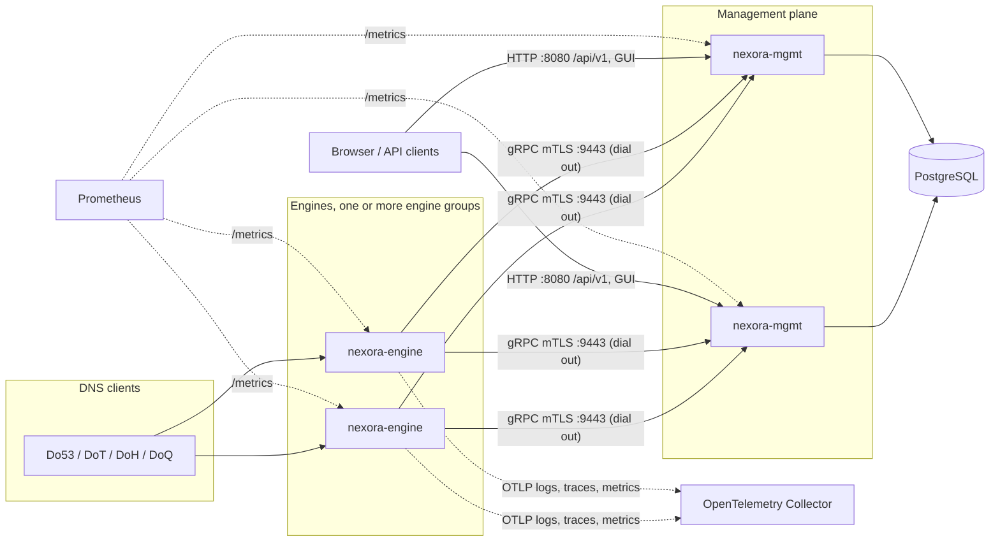
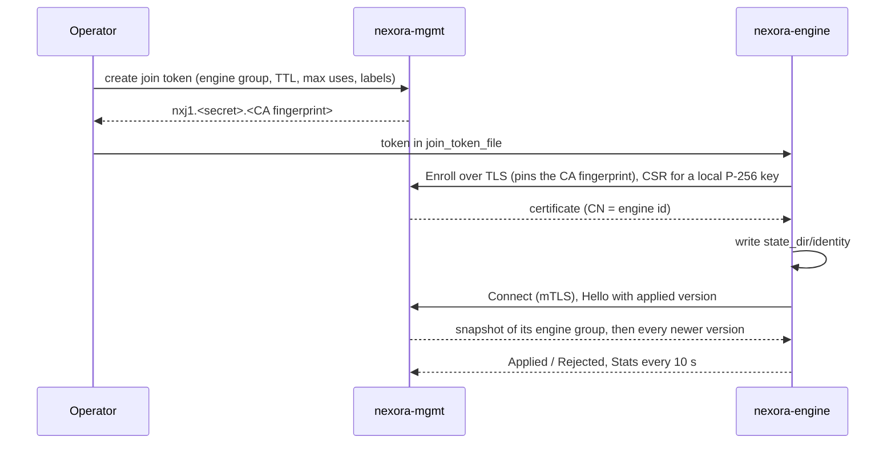
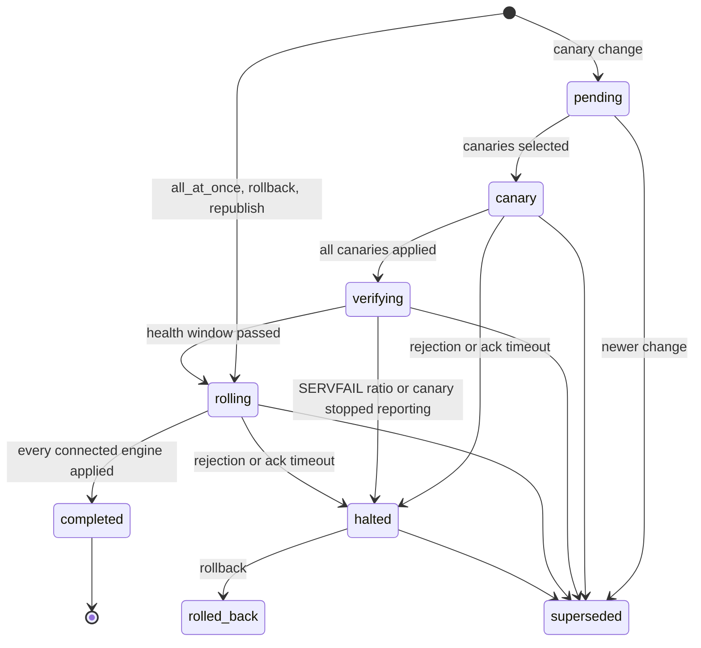

# Operating Nexora

This guide is for operators installing and running Nexora, from a single
homelab host to an ISP fleet. The design behind it is in
`docs/architecture.md`; this document covers the how-to.

- [Overview](#overview)
- [Install with Helm](#install-with-helm)
- [Install with Docker Compose](#install-with-docker-compose)
- [Install with the Kubernetes operator](#install-with-the-kubernetes-operator)
- [First-run setup and access](#first-run-setup-and-access)
- [Enrolling engines](#enrolling-engines)
- [Encrypted DNS: DoT, DoH and DoQ](#encrypted-dns-dot-doh-and-doq)
- [Key storage](#key-storage)
- [Upgrade](#upgrade)
- [Backup and restore PostgreSQL](#backup-and-restore-postgresql)
- [PostgreSQL high availability and backups](#postgresql-high-availability-and-backups)
- [Engine groups and staged rollouts](#engine-groups-and-staged-rollouts)
- [Engine lifecycle](#engine-lifecycle)
- [Monitoring and alerts](#monitoring-and-alerts)
- [Performance tuning](#performance-tuning)
- [kw deployment](#kw-deployment)
- [Known limitations](#known-limitations)
- [Troubleshooting](#troubleshooting)

## Overview

Nexora has two binaries and a GUI:

- **`nexora-engine`** (Rust, Linux only) answers DNS. It dials out to the
  management plane, receives versioned configuration snapshots, stores the last
  one it applied in its state directory, and keeps serving from that snapshot
  when the management plane is unreachable. Query processing never touches a
  database or blocks on logging.
- **`nexora-mgmt`** (Go) is the management plane: HTTP API (`/api/v1`), the
  embedded React GUI, Prometheus metrics, and the gRPC control service engines
  connect to. It is stateless. Everything except in-memory query logs lives in
  PostgreSQL, so you can run any number of replicas behind a load balancer.
- **PostgreSQL** holds configuration, users, audit, engine records, rollouts
  and sealed secrets. Running PostgreSQL itself, including HA, is your job.



### Features

| Milestone | What you get                                                                                                                                                                                                                                                                       |
| --------- | ---------------------------------------------------------------------------------------------------------------------------------------------------------------------------------------------------------------------------------------------------------------------------------- |
| M1        | Forwarding over UDP, TCP, DoT and DoH upstreams (`ordered` or `fastest`), wire-format cache with serve-stale, blocklist subscriptions and allowlist, client ACL, Prometheus and OTLP telemetry, query log (built-in or OpenSearch), users, roles, API tokens, OIDC, audit, the GUI |
| M2        | DoT, DoH and DoQ listeners with certificates pushed over the control stream, per-client policy groups chosen by source CIDR, safe search, custom rewrites, PROXY v2 on DoT/DoH                                                                                                     |
| M3        | Iterative recursion from root hints, DNSSEC validation of recursive and forwarded answers (RFC 5011 trust anchors, negative trust anchors), forward zones, RPZ from files or AXFR/IXFR with TSIG                                                                                   |
| M4        | Authoritative primary and secondary zones, AXFR/IXFR out with ACLs and TSIG, NOTIFY, RFC 2136 dynamic updates, BIND zone file import and export, online DNSSEC signing with key rollovers and CDS/CDNSKEY, key storage under a key-encryption key or in a PKCS#11 HSM              |
| M5        | Engine groups with group-scoped configuration, canary rollouts with a health halt, rollback, fleet health, join tokens bound to groups, certificate renewal, rotation and revocation, release images, the Compose example and the Helm chart                                       |

### Ports

| Process         | Port           | Purpose                                                                          |
| --------------- | -------------- | -------------------------------------------------------------------------------- |
| `nexora-mgmt`   | 8080/TCP       | GUI, `/api/v1`, `/metrics` (`NEXORA_HTTP_LISTEN`)                                |
| `nexora-mgmt`   | 9443/TCP       | engine control (mTLS) and the built-in query-log receiver (`NEXORA_GRPC_LISTEN`) |
| `nexora-engine` | 53/UDP, 53/TCP | DNS (`listen_udp`, `listen_tcp`)                                                 |
| `nexora-engine` | 853/TCP        | DoT (`listen_dot`, off unless set)                                               |
| `nexora-engine` | 443/TCP        | DoH at `doh_path`, default `/dns-query` (`listen_doh`, off unless set)           |
| `nexora-engine` | 853/UDP        | DoQ (`listen_doq`, off unless set)                                               |
| `nexora-engine` | 9153/TCP       | `/metrics` (`metrics_listen`)                                                    |

### Management plane environment

`nexora-mgmt serve` reads only environment variables
(`mgmt/internal/config/config.go`). File-based secrets are passed as paths.

| Variable                                                                                     | Default                          | Notes                                                                                               |
| -------------------------------------------------------------------------------------------- | -------------------------------- | --------------------------------------------------------------------------------------------------- |
| `NEXORA_DATABASE_URL`                                                                        | required                         | PostgreSQL connection URL                                                                           |
| `NEXORA_CA_CERT_FILE`, `NEXORA_CA_KEY_FILE`                                                  | required                         | the engine CA (`nexora-mgmt ca init`)                                                               |
| `NEXORA_HTTP_LISTEN`                                                                         | `:8080`                          |                                                                                                     |
| `NEXORA_GRPC_LISTEN`                                                                         | `:9443`                          |                                                                                                     |
| `NEXORA_GRPC_SERVER_NAMES`                                                                   | empty                            | comma-separated names and IPs for the gRPC server certificate; must include what engines dial       |
| `NEXORA_PUBLIC_URL`                                                                          | empty                            | external GUI URL, used for OIDC redirects (`<url>/api/v1/auth/oidc/callback`)                       |
| `NEXORA_SECURE_COOKIES`                                                                      | `true`                           | set `false` only for plain-HTTP test setups                                                         |
| `NEXORA_QUERYLOG_BACKEND`                                                                    | `builtin`                        | `builtin`, `opensearch`, `clickhouse` or `loki`                                                     |
| `NEXORA_QUERYLOG_BUILTIN_CAPACITY`                                                           | `200000`                         | records kept in memory per instance                                                                 |
| `NEXORA_OPENSEARCH_URL`, `_INDEX`, `_USERNAME`, `_PASSWORD_FILE`                             | index `nexora-querylog-*`        | URL required with `opensearch`                                                                      |
| `NEXORA_CLICKHOUSE_URL`                                                                      | empty                            | ClickHouse HTTP interface, e.g. `http://clickhouse:8123`; required with `clickhouse`                |
| `NEXORA_CLICKHOUSE_DATABASE`                                                                 | `nexora`                         | database holding the query-log table                                                                |
| `NEXORA_CLICKHOUSE_TABLE`                                                                    | `querylog`                       | query-log table; a plain identifier                                                                 |
| `NEXORA_CLICKHOUSE_USERNAME`                                                                 | `default`                        | ClickHouse user; give it SELECT only                                                                |
| `NEXORA_CLICKHOUSE_PASSWORD_FILE`                                                            | empty                            | file holding that user's password; empty sends none                                                 |
| `NEXORA_LOKI_URL`                                                                            | empty                            | Loki base URL, e.g. `http://loki:3100`; required with `loki`                                        |
| `NEXORA_LOKI_SELECTOR`                                                                       | `{service_name="nexora-engine"}` | LogQL stream selector of the engine records, in braces                                              |
| `NEXORA_LOKI_TENANT`                                                                         | empty                            | sent as `X-Scope-OrgID`; empty sends no header                                                      |
| `NEXORA_LOKI_USERNAME`                                                                       | empty                            | basic auth user; empty sends no credentials                                                         |
| `NEXORA_LOKI_PASSWORD_FILE`                                                                  | empty                            | file holding the basic auth password                                                                |
| `NEXORA_LOKI_LOOKBACK`                                                                       | `168h`                           | search and top list window when no start time is given, `1h` to `721h` (checked with every backend) |
| `NEXORA_OTLP_ENDPOINT`                                                                       | empty                            | OTLP gRPC endpoint handed to engines when the resolver settings and engine group set none           |
| `NEXORA_DNS_TLS_CERT_FILE`, `NEXORA_DNS_TLS_KEY_FILE`                                        | empty                            | DoT/DoH/DoQ certificate pushed to engines; both or neither                                          |
| `NEXORA_DNS_TLS_RELOAD_INTERVAL`                                                             | `30s`                            | minimum `1s`                                                                                        |
| `NEXORA_KEK_FILE`                                                                            | empty                            | base64 of 32 random bytes; see [Key storage](#key-storage)                                          |
| `NEXORA_PKCS11_MODULE`, `_TOKEN_LABEL`, `_PIN_FILE`                                          | empty                            | all three or none                                                                                   |
| `NEXORA_OIDC_ISSUER`, `_CLIENT_ID`, `_CLIENT_SECRET_FILE`, `_ADMIN_GROUP`, `_OPERATOR_GROUP` | empty                            | client id and secret file required when the issuer is set                                           |
| `NEXORA_ENGINE_CERT_TTL`                                                                     | `2160h` (90 days)                | lifetime of issued engine certificates, minimum `30s`                                               |
| `NEXORA_ROLLOUT_TICK`                                                                        | `1s`                             | rollout controller tick, `100ms` to `1m`                                                            |
| `NEXORA_CATALOG_MIRROR`                                                                      | empty                            | base URL serving every catalog source at `<base>/<source key>` (air-gapped, tests); adds none       |
| `NEXORA_REPOSITORY_URL`                                                                      | empty                            | https URL of the source repository; the GUI links the build commit to `<url>/commit/<sha>`          |
| `NEXORA_TRUSTED_PROXY_CIDRS`                                                                 | empty                            | reverse proxies whose `X-Forwarded-For` is believed when throttling failed logins                   |

Subcommands (`nexora-mgmt` with no arguments prints the usage):

```text
nexora-mgmt serve | version | migrate
nexora-mgmt ca init --out <dir> [--if-missing]
nexora-mgmt ca issue-dns --ca-cert F --ca-key F --names N[,N...] [--days 90] --out <dir>
nexora-mgmt user create --admin --username U --email E --password-file F
nexora-mgmt engine-group create --name N [--description D] [--if-missing]
nexora-mgmt join-token create --engine-group G [--name N] [--ttl 24h] [--max-uses N] [--label k=v]...
```

`migrate`, `user create`, `engine-group create` and `join-token create` need
`NEXORA_DATABASE_URL`; `join-token create` also needs `NEXORA_CA_CERT_FILE`,
because the token embeds the CA fingerprint. `serve` applies pending migrations
itself as well.

### Engine bootstrap file

The engine reads `engine.toml` (`nexora-engine --config /etc/nexora/engine.toml`).
Only host settings live there; everything else arrives in snapshots. The full
reference is in `docs/architecture.md`. The essentials:

```toml
node_name = "edge-1"                        # [a-z0-9-]{1,63}; NEXORA_ENGINE_NODE_NAME overrides it
state_dir = "/var/lib/nexora"
management_urls = ["https://mgmt.example.net:9443"]
join_token_file = "/etc/nexora/join-token"  # read only while state_dir/identity is missing
listen_udp = ["0.0.0.0:53"]
listen_tcp = ["0.0.0.0:53"]
metrics_listen = "0.0.0.0:9153"
workers = 0                                  # 0 = one per CPU
# listen_dot = ["0.0.0.0:853"]
# listen_doh = ["0.0.0.0:443"]
# listen_doq = ["0.0.0.0:853"]
```

## Install with Helm

The chart is `deploy/helm/nexora`. Every value is validated by
`deploy/helm/nexora/values.schema.json`; the defaults are in
`deploy/helm/nexora/values.yaml`.

The chart also has opt-in `engine.groups[].failoverPairs` for two-member, distinct-node DNS availability pairs. These require `engine.pairedRollout.enabled=true`: DaemonSets default to `OnDelete`, and only the full workload name in `engine.pairedRollout.workload` may roll automatically. Pair Services retain `externalTrafficPolicy: Local`; a pair-specific PodDisruptionBudget requires one available pod. Instances colocated across different pairs must have separate `stateDirName` values to avoid sharing identities. Both nodes in a pair must be eligible to announce the VIP.

**Use `scripts/kw-deploy.sh` for the guarded kw migration; live rollout acceptance is still pending.** The executable workflow verifies management/configuration, persisted identities, node capacity/announcers, direct/VIP DNS and actual endpoints. It holds one non-expiring lock across supporting resources, serial Helm stages and bootstrap. PDBs do not serialize controller updates. Do not use ordinary Helm upgrades: existing pods initially lack pair labels. `engine.pairedRollout.legacySelectors=true` retains each pair's first member selector until UID-safe enrolment and candidate membership are verified. Failures retain the lock; no automatic takeover or partial-topology repair is permitted. Evidence: `.procoder/notes/kw-rollout-integration.md`.

Prerequisites:

- Kubernetes 1.28 or newer.
- PostgreSQL, one of:
  - the CloudNativePG operator, for `database.mode=cnpg` (the default). The
    chart creates a CNPG `Cluster` named `nexora-db` (2 instances, 10Gi,
    image `ghcr.io/cloudnative-pg/postgresql:17.6`) and reads the connection
    URL from the secret `nexora-db-app`, key `uri`. Rendering fails without the
    operator's API.
  - an existing database, for `database.mode=external`: a secret holding the
    connection URL (`database.external.existingSecret`, key
    `database.external.key`, default `uri`). Nexora is tested on PostgreSQL 17.
- Prometheus Operator CRDs, only when `metrics.serviceMonitor.enabled` or
  `metrics.prometheusRule.enabled` is set.

Resource names use a prefix: the release name when it contains `nexora`,
otherwise `<release>-nexora`. The commands below use release `nexora` in
namespace `nexora`, so the prefix is `nexora`.

1. Create the engine CA once and keep an offline copy. Losing it means
   re-enrolling every engine. From a checkout (or run the `nexora-mgmt` image
   with the same arguments):

   ```sh
   kubectl create namespace nexora
   go run ./mgmt/cmd/nexora-mgmt ca init --out ./nexora-ca
   kubectl -n nexora create secret generic nexora-ca \
     --from-file=ca.crt=./nexora-ca/ca.crt --from-file=ca.key=./nexora-ca/ca.key
   ```

   Optionally create now:
   - a key-encryption key for TSIG keys, RPZ TSIG secrets and DNSSEC keys
     (`mgmt.kek.existingSecret`):
     `openssl rand -base64 32 | kubectl -n nexora create secret generic nexora-kek --from-file=kek=/dev/stdin`
   - a `kubernetes.io/tls` secret for DoT/DoH/DoQ (`mgmt.dnsTLS.existingSecret`),
     see [Encrypted DNS](#encrypted-dns-dot-doh-and-doq).
   - for `database.mode=external`:
     `kubectl -n nexora create secret generic nexora-db --from-literal=uri='postgres://nexora:<password>@db.example.net:5432/nexora?sslmode=require'`

2. Install the management plane without engines (engine workloads need join
   token secrets, which need the management plane):

   ```sh
   helm upgrade --install nexora deploy/helm/nexora -n nexora \
     --set image.registry=<registry> --set image.tag=<tag> \
     --set mgmt.ca.existingSecret=nexora-ca \
     --set engine.enabled=false --wait
   ```

   `image.registry` defaults to the project's own registry; the images are
   `<registry>/nexora-mgmt:<tag>` and `<registry>/nexora-engine:<tag>`, and the
   tag defaults to the chart's `appVersion`. Expose the GUI with
   `mgmt.ingress.*` (TLS with `mgmt.ingress.clusterIssuer` for cert-manager) and
   set `mgmt.publicURL` to its URL.

3. Complete first-run setup, see
   [First-run setup and access](#first-run-setup-and-access).

4. Create engine groups and join token secrets, see
   [Enrolling engines](#enrolling-engines).

5. Describe the engine workloads in `engine.groups` and upgrade without
   `engine.enabled=false`:

   ```yaml
   engine:
     kind: DaemonSet # or Deployment (groups[].replicas)
     workers: 2
     ports: { dns: 53, metrics: 9153, dot: 853, doh: 443, doq: 853 } # 0 disables an encrypted listener
     stateDir: { type: hostPath, hostPathPrefix: /var/lib/nexora }
     groups:
       - name: default
         joinTokenSecret: nexora-join-default
         service:
           {
             type: LoadBalancer,
             loadBalancerIP: 192.0.2.53,
             externalTrafficPolicy: Local,
           }
       - name: edge
         nodeNamePrefix: edge-
         joinTokenSecret: nexora-join-edge
         nodeAffinity:
           requiredDuringSchedulingIgnoredDuringExecution:
             nodeSelectorTerms:
               - matchExpressions:
                   - {
                       key: nexora.io/engine-group,
                       operator: In,
                       values: [edge],
                     }
   ```

   Each group gets its own workload (`<prefix>-engine-<name>` unless
   `workloadName` is set), ConfigMap with `engine.toml`, and DNS Service
   (`<prefix>-dns-<name>` unless `service.name` is set). The Service exposes 53,
   and 853/TCP, 853/UDP and 443/TCP for the encrypted listeners that are
   enabled. `groups[].extraServices` adds more addresses over the same group.
   `groups[].name` in the chart only names the workload; the engine group an
   engine joins comes from its join token.

   To run one engine per address instead, give the group `instances`: each
   renders its own workload `<group workload>-<instance name>` pinned to
   `node` (node affinity `kubernetes.io/hostname In [node]`, added to every
   term of the group's `nodeAffinity`) with the pod label
   `nexora.io/engine-instance: <instance name>`, and its optional `service`
   selects only that engine. The instances share the group's ConfigMap and
   state directory name, so an instance on a node keeps the identity of the
   group workload's engine there. With `instances` the group renders no
   workload of its own, and `service` and `extraServices` only when set:

   ```yaml
   groups:
     - name: default
       joinTokenSecret: nexora-join-default
       instances:
         - {
             name: a,
             node: node-1,
             service: { name: dns-a, loadBalancerIP: 192.0.2.53 },
           }
         - {
             name: b,
             node: node-2,
             service: { name: dns-b, loadBalancerIP: 192.0.2.54 },
           }
   ```

   Moving an existing group to instances replaces its workload and Services
   (selectors are immutable); an address is not served between the removal
   of the old objects and the new engine becoming ready.

What the chart sets up:

- **Management plane**: Deployment `<prefix>-mgmt` (`mgmt.replicas`, default
  2, spread across nodes), a `migrate` init container, readiness on
  `/api/v1/health`, a PodDisruptionBudget (`minAvailable: 1`) when replicas
  exceed 1, Service `<prefix>-mgmt` (8080) and Service `<prefix>-mgmt-grpc`
  (9443). `mgmt.grpcLoadBalancer.enabled` adds a gRPC-only LoadBalancer for
  engines outside the cluster; its IP is added to the server certificate.
  Extra certificate names go in `mgmt.grpcServerNames`. Extra environment
  (OIDC, OpenSearch credentials) goes in `mgmt.extraEnv`, `mgmt.extraVolumes`
  and `mgmt.extraVolumeMounts`.
- **Engines** dial `https://<prefix>-mgmt-grpc.<namespace>.svc.cluster.local:9443`
  unless `engine.managementURL` is set. The engine name is
  `<nodeNamePrefix><Kubernetes node name>`, so a restarted pod keeps its
  identity. Pods run as uid 10001 with the namespaced sysctl
  `net.ipv4.ip_unprivileged_port_start=0` to bind port 53.
- **Engine state**: `engine.stateDir.type=hostPath` (default) keeps identity,
  snapshot and caches in `<hostPathPrefix>/<group workload>` on the node across pod
  restarts. `emptyDir` enrolls a new engine after every pod restart and needs
  a join token that is still valid.
- **Client addresses**: DNS Services default to `externalTrafficPolicy: Local`,
  so engines see real client IPs (needed by per-client policy and the query
  log). The node that announces the LoadBalancer address must then run an
  engine of that group. `Cluster` works everywhere but engines see node
  addresses.
- **`engine.hostNetwork: true`** binds the engine ports on the node. The pod
  can no longer set the sysctl, so the node's
  `net.ipv4.ip_unprivileged_port_start` must be at or below the lowest engine
  port, and two engine groups must not share a node.
- **Optional**: `otelCollector.enabled` deploys an OpenTelemetry Collector
  (`<prefix>-otelcol`) and points `NEXORA_OTLP_ENDPOINT` at it when
  `mgmt.otlpEndpoint` is empty; `metrics.serviceMonitor` and
  `metrics.prometheusRule`, see [Monitoring and alerts](#monitoring-and-alerts).

## Install with Docker Compose

`deploy/compose` runs PostgreSQL 17, a one-shot CA initialiser, migrations, one
management plane, one engine (profile `engine`) and an optional OpenTelemetry
Collector (profile `otel`). It suits a single host. The engine is Linux only.

```sh
cd deploy/compose
cp .env.example .env                                   # set NEXORA_TAG (and NEXORA_REGISTRY)
openssl rand -hex 24 > secrets/postgres-password
printf 'postgres:5432:nexora:nexora:%s\n' "$(cat secrets/postgres-password)" > secrets/pgpass
chmod 0644 secrets/postgres-password secrets/pgpass    # read by the postgres and nexora-mgmt users
docker compose up -d                                   # postgres, CA, migrations, mgmt
docker compose logs mgmt | grep "setup token"          # complete /setup at NEXORA_PUBLIC_URL
docker compose run --rm -T mgmt join-token create --engine-group default --ttl 1h > secrets/join-token
docker compose --profile engine up -d
docker compose --profile otel up -d                    # optional collector (otel-collector.yaml)
```

- `.env` settings: `NEXORA_TAG`, `NEXORA_REGISTRY`, `NEXORA_PUBLIC_URL`
  (default `http://localhost:8080`), `NEXORA_PUBLIC_HOST` (added to the gRPC
  certificate), `NEXORA_SECURE_COOKIES` (`false` because the example serves
  plain HTTP; set `true` behind an HTTPS reverse proxy),
  `NEXORA_DNS_PORT`, `NEXORA_HTTP_PORT`, `NEXORA_GRPC_PORT`,
  `NEXORA_METRICS_PORT`, `NEXORA_ENGINE_NODE_NAME`, `NEXORA_OTLP_ENDPOINT`
  (for the bundled collector: `http://otel-collector:4317`).
- The CA lives in the volume `ca`, the database in `pgdata`, the engine state
  in `enginestate`. Back up `ca` together with the database.
- The collector in `deploy/compose/otel-collector.yaml` only prints what it
  receives (`debug` exporter). Replace the exporters to send data to a real
  backend. With the built-in query log, engines send query logs to the
  management plane, so the collector receives the engines' OTLP metrics
  (every 15 seconds) and traces only.
- Hosts that cannot pull from the registry (for example one whose certificate
  the Docker daemon does not trust): on a machine that can, run
  `crane pull --platform linux/<arch> <registry>/nexora-mgmt:<tag> mgmt.tar`,
  copy the file and run `docker load < mgmt.tar` on the host; the same for
  `nexora-engine`. Set `NEXORA_REGISTRY` to the `<registry>` the images were
  pulled as, since `docker load` keeps that name.
- Engines on other hosts use the same `engine.toml` with
  `management_urls = ["https://<NEXORA_PUBLIC_HOST>:9443"]`, a unique
  `node_name` and their own join token.
- The example is checked statically (`TestComposeExample`) and run for real on
  a Docker host with `scripts/compose-verify.sh user@host` (last verified on
  novanas, x86_64, Docker 29.4.1, Compose v5.1.3).

## Install with the Kubernetes operator

The operator (`nexora-operator`) manages Nexora with two namespaced custom
resources in API group `nexora.io/v1alpha1`: `NexoraInstallation` (`nxi`), one
Nexora installation, and `NexoraEngineGroup` (`nxeg`), one engine group of an
installation with its join token. It renders the same chart as
[Install with Helm](#install-with-helm) (`deploy/helm/nexora`, shipped inside
the operator image) and applies the result with server-side apply, so the
workloads are identical to a Helm install. The design is in
`docs/architecture.md` (Platform (M9)).

Prerequisites:

- Kubernetes 1.28 or newer.
- The CloudNativePG operator (1.25 or newer) for `database.mode: cnpg`, the
  default; otherwise an existing database and `database.mode: external`.
- Prometheus Operator CRDs, only for `metrics.serviceMonitor` or
  `metrics.prometheusRule`.

### Installing the operator

With Helm, watching every namespace (ClusterRole and ClusterRoleBinding):

```sh
helm upgrade --install nexora-operator deploy/helm/nexora-operator -n nexora-operator --create-namespace \
  --set image.registry=<registry> --set image.tag=<tag>
```

To watch only some namespaces (a Role and RoleBinding in each), add
`--set rbac.scope=namespace --set-json 'watchNamespaces=["nexora"]'`. Other
values (`deploy/helm/nexora-operator/values.yaml`): `replicas` with
`leaderElection` (on by default), `imagePullSecrets` and `resources`. The
image is `<registry>/nexora-operator:<tag>`; the tag defaults to the chart's
`appVersion`.

Without Helm, apply the generated CRDs and the plain manifests (namespace
`nexora-operator`, cluster scope, rendered from the same chart):

```sh
kubectl apply --server-side -f deploy/operator/crds/ && kubectl apply -f deploy/operator/operator.yaml
```

Helm installs the chart's `crds/` only on the first install and never
upgrades or deletes them, so apply `deploy/operator/crds/` with
`--server-side` before upgrading the operator either way.

### A NexoraInstallation and its engine groups

`spec.mgmt.ai.existingSecret` names an existing Secret in the installation namespace
with optional `base-url`, `model`, and `api-key` keys; credentials stay in the Secret.
`spec.mgmt.mcp.enabled` and `spec.mgmt.mcp.readOnly` map directly to chart values.
Omitting them preserves the chart defaults (`false` and `true`, respectively);
explicit `false` is preserved for either setting.

The spec uses the chart's value names (`image`, `imagePullSecrets`, `mgmt`,
`database`, `engine`, `otelCollector`, `metrics`). A field left out takes the
default from `deploy/helm/nexora/values.yaml`: the CRD sets no defaults of its
own. This installation runs two management replicas on a two-instance CNPG
cluster with backups, two engines pinned to nodes with their own addresses, and
an `edge` group on labelled nodes (the example of the operator's kw e2e,
`operator/test/kw/testdata/`, with placeholder addresses and nodes):

```yaml
apiVersion: nexora.io/v1alpha1
kind: NexoraInstallation
metadata:
  name: nexora
  namespace: nexora
spec:
  image:
    registry: <registry>
    tag: <tag> # default: the operator's own version
  mgmt:
    replicas: 2
    publicURL: https://nexora.example.net
    ingress:
      { enabled: true, host: nexora.example.net, clusterIssuer: <issuer> }
  database:
    mode: cnpg
    cnpg:
      instances: 2
      storageClass: <storage class>
      size: 10Gi
      backup:
        enabled: true
        destinationPath: s3://nexora-backups/nexora
        endpointURL: http://minio.minio.svc.cluster.local:9000
        s3Credentials:
          existingSecret: nexora-s3
          accessKeyIdKey: ACCESS_KEY_ID
          secretAccessKeyKey: ACCESS_SECRET_KEY
  engine:
    kind: DaemonSet
    workers: 2
    stateDir: { type: hostPath, hostPathPrefix: /var/lib/nexora }
    groups:
      - name: default
        instances:
          - name: a
            node: <node-1>
            service:
              {
                name: nexora-dns-a,
                type: LoadBalancer,
                loadBalancerIP: 192.0.2.53,
              }
          - name: b
            node: <node-2>
            service:
              {
                name: nexora-dns-b,
                type: LoadBalancer,
                loadBalancerIP: 192.0.2.54,
              }
      - name: edge
        nodeAffinity:
          requiredDuringSchedulingIgnoredDuringExecution:
            nodeSelectorTerms:
              - matchExpressions:
                  - {
                      key: nexora.io/engine-group,
                      operator: In,
                      values: [edge],
                    }
        service:
          {
            name: nexora-dns-edge,
            type: LoadBalancer,
            loadBalancerIP: 192.0.2.55,
          }
---
apiVersion: nexora.io/v1alpha1
kind: NexoraEngineGroup
metadata:
  name: default
  namespace: nexora
spec:
  installationRef: { name: nexora }
  groupName: default # default: metadata.name
---
apiVersion: nexora.io/v1alpha1
kind: NexoraEngineGroup
metadata:
  name: edge
  namespace: nexora
spec:
  installationRef: { name: nexora }
  description: edge sites
  rollout: { strategy: canary, canaryCount: 1 }
  joinToken: { ttl: 8760h, renewBefore: 720h, revokeGracePeriod: 10m }
  deletionPolicy: Delete # default: Retain
```

What the operator adds to the values, and what the CRD therefore has no field
for:

- `mgmt.ca.existingSecret` and `mgmt.kek.existingSecret`: the Secrets you name
  in the spec (they must exist and hold `ca.crt`/`ca.key` and `kek`), or the
  operator's own `<name>-ca` (a new ECDSA P-256 CA) and `<name>-kek`.
- `mgmt.bootstrapToken.existingSecret`: always `<name>-operator-token`.
- `engine.groups[].joinTokenSecret`: the Secret of the `NexoraEngineGroup`
  named by `engineGroupRef` (default: the group's `name`). A group whose
  `NexoraEngineGroup` is missing, references another installation or is not
  `JoinTokenReady` renders no engines yet (`EnginesReady=False`,
  `JoinTokenPending`) while everything else renders, so a fresh install needs
  no second step.
- `image.tag` when unset: the operator's version; a development operator
  (`dev`) requires `spec.image.tag` (`ImageTagRequired`).
- `metrics.serviceMonitor.namespace` and `metrics.prometheusRule.namespace` are
  emptied: every object lands in the installation's namespace, and an object
  rendered for another namespace is refused (`ForeignNamespace`).

Resource names follow the chart's prefix rule with the CR name as the release
name (`nexora` above: `nexora-mgmt`, `nexora-db`, `nexora-dns-a`). Every
rendered object carries the label `nexora.io/installation: <name>`.

Generated Secrets and their retention:

| Secret                  | Keys               | Owner                   | On deletion of the CR                          |
| ----------------------- | ------------------ | ----------------------- | ---------------------------------------------- |
| `<name>-ca`             | `ca.crt`, `ca.key` | none (label only)       | kept                                           |
| `<name>-kek`            | `kek`              | none (label only)       | kept                                           |
| `<name>-operator-token` | `token` (`nxt_…`)  | none (label only)       | kept                                           |
| `<cr name>-join-token`  | `join-token`       | the `NexoraEngineGroup` | garbage-collected with the `NexoraEngineGroup` |

The operator creates a missing Secret, never overwrites or deletes one, and
reports a Secret that lacks a key as `SecretIncomplete`. Keep an offline copy
of `<name>-ca` and `<name>-kek` like any other CA and KEK (see
[What state lives where](#what-state-lives-where)). `joinToken.secretName`
chooses another name for the join token Secret; an existing Secret of that name
that the `NexoraEngineGroup` does not control is left alone and reported as
`Conflict`.

### Engine groups and join tokens

A `NexoraEngineGroup` acts through the management API with the operator
token, and only once its installation is `ManagementReady`. It adopts an
existing group of the same name (`default` always exists) or creates it. Only
the fields set in the CR are managed (`description`, `upstreamMode`,
`extraACLCIDRs`, `otlpEndpoint`, `filterIndexMaxBytes`, `rollout`); fields left
out keep whatever the GUI or API set. `groupName` and `installationRef` are
immutable, and a second CR for the same group of one installation gets
`DuplicateGroupName`.

The join token lives in the Secret `<cr name>-join-token`, key `join-token`:

- A token is created with `joinToken.ttl` (default `8760h`, from `1m` to
  `8760h`), `maxUses` and `labels`, and named
  `op/<cr uid>/<unix seconds>/<namespace>/<cr name>` (cut to 64 characters).
  The `op/<cr uid>/` prefix marks every token of this CR, including those of a
  deleted and recreated CR of the same name, which have a different uid.
- The controller rotates when the Secret is missing, the recorded token is no
  longer `active`, or it expires within `renewBefore` (default `720h`). It
  first revokes the CR's older tokens (the previous token and any marked token
  that status does not record, which a failed status write can leave behind),
  then creates the new one. The replaced token stays valid for
  `revokeGracePeriod` (default `10m`) so an engine that read the Secret just
  before the rotation can still enroll.
- A revoke that fails stops the rotation: nothing is created, the Secret keeps
  its token, and `JoinTokenReady=False` with `JoinTokenRevokeFailed` until the
  revoke succeeds (retried every 30 s). A CR never owns more than 3 active
  tokens (the current one, the previous one in its grace period, and one of
  slack); past that it reports `JoinTokenLimit` and creates none.
- Enrolled engines never need the token again, so a rotation does not restart
  them (the Secret content changes; hostPath state keeps their identity).

### Status and conditions

```sh
kubectl -n nexora get nxi,nxeg              # Ready, Version / Group, Ready, Engines
kubectl -n nexora describe nxi nexora       # conditions with reason and message, status.workloads
kubectl -n nexora get nxeg edge -o jsonpath='{.status.conditions}'
kubectl -n nexora-operator logs deploy/nexora-operator
```

`NexoraInstallation` (`status.version`, `status.managementURL`,
`status.secrets`, `status.workloads` with each engine workload's desired,
updated and ready counts):

| Condition         | True when                                                                                    | Reasons when not                                                           |
| ----------------- | -------------------------------------------------------------------------------------------- | -------------------------------------------------------------------------- |
| `Rendered`        | the chart rendered, every object applied and pruning finished                                | `RenderFailed`, `ImageTagRequired`, `SecretIncomplete`, `ForeignNamespace` |
| `DatabaseReady`   | the CNPG `Cluster` is `Ready` (external mode: the database Secret exists)                    | `Unavailable`                                                              |
| `ManagementReady` | the mgmt Deployment has an available replica and `/api/v1/health` accepts the operator token | `ManagementUnavailable`, `Unauthorized`                                    |
| `SetupRequired`   | no human user exists yet (first-run setup is pending); `Unknown` while mgmt is not ready     | —                                                                          |
| `EnginesReady`    | every engine workload is updated and ready, and no group waits for its join token            | `JoinTokenPending`, `RollingUpdate`, `Unavailable`                         |
| `Ready`           | `Rendered`, `DatabaseReady`, `ManagementReady` and `EnginesReady` are all true               | the reason of the first one that is not                                    |

A render or apply failure changes nothing and prunes nothing; the reason's
message carries the chart or API error (for example a missing required value).
The installation is re-checked every 60 s (`--resync-interval`) and on every
change of its objects.

`NexoraEngineGroup` (`status.groupID`, `revision`, `engineCount`,
`joinTokenSecret`, `joinTokenExpiresAt`, the current and previous token ids):

| Condition        | True when                                        | Reasons when not                                                                                                 |
| ---------------- | ------------------------------------------------ | ---------------------------------------------------------------------------------------------------------------- |
| `Synced`         | the group matches the CR in the management plane | `ManagementUnavailable` (retry 10 s), `Unauthorized` (30 s), `Conflict`, `DuplicateGroupName`, `DeletionBlocked` |
| `JoinTokenReady` | the Secret holds an active, unexpired token      | `JoinTokenRevokeFailed`, `JoinTokenLimit`, `Conflict`                                                            |
| `Ready`          | both are true                                    | the failing condition's reason                                                                                   |

While the management plane is unreachable, `JoinTokenReady` keeps its last
value: the Secret and its token stay valid.

### First-run setup and the operator's API token

The operator needs no human account. The management plane creates the system
user `nexora-operator` (source `system`, role `admin`, no password, cannot log
in or be edited or deleted) with one API token named `bootstrap`, whose value
is the Secret `<name>-operator-token`. Its actions appear in the audit log as
that user.

First-run setup stays manual: `SetupRequired=True` means no human admin exists.
Complete it as in [First-run setup and access](#first-run-setup-and-access),
with the prefix of the installation (`kubectl -n nexora logs -l
app.kubernetes.io/name=nexora-mgmt -c mgmt --tail=-1 | grep "setup token"`).
Engine groups and engines do not wait for it.

To rotate the operator's token, delete its Secret:

```sh
kubectl -n nexora delete secret nexora-operator-token
```

The operator recreates it with a new token on its next reconcile. The kubelet
updates the mounted file in the mgmt pods, and within
`NEXORA_BOOTSTRAP_TOKEN_RELOAD_INTERVAL` (default `30s`) the management plane
makes the new value the only `bootstrap` token and revokes the old one. Until
then both CRs may show `Unauthorized` for a minute or two.

### Upgrading

- Apply the new CRDs, then upgrade the operator (Helm or the plain manifests).
  The operator image carries the chart of the same commit, so an operator
  upgrade can change the rendered objects.
- Without `spec.image.tag` the installation follows the operator's version:
  the upgrade rolls the management plane (with its `migrate` init container)
  and the engines. With `spec.image.tag` set, Nexora changes only when you edit
  the tag. Back up first, as in [Upgrade](#upgrade).
- Engines roll exactly as with Helm (one pod at a time; see
  [Upgrade](#upgrade)). Watch `EnginesReady` (`RollingUpdate`) and
  `status.workloads`.
- An engine group removed from `spec.engine.groups` has its workload,
  ConfigMap and Services pruned; the management-plane group stays until its
  `NexoraEngineGroup` is deleted.

### Deleting

What the operator never deletes:

- the CNPG `Cluster` (and with it the database volumes, the `<clusterName>-app`
  Secret and the backups in object storage), which carries no owner reference
  and is never pruned;
- the Secrets `<name>-ca`, `<name>-kek` and `<name>-operator-token`, and every
  Secret you named in the spec;
- the engine state directories on the nodes (`engine.stateDir.hostPathPrefix`);
- a management-plane engine group under `deletionPolicy: Retain`, and the group
  `default` under any policy;
- the CRDs, the `NexoraEngineGroup` objects and the namespace.

Deleting a `NexoraInstallation` removes the workloads, ConfigMaps, Services,
PodDisruptionBudget, Ingress, `ScheduledBackup`, ServiceMonitor and
PrometheusRule through their owner references. Recreating it with the same name
reuses the retained database and Secrets.

Deleting a `NexoraEngineGroup` revokes every token carrying its marker; with
`deletionPolicy: Delete` it also deletes the group. The management plane
refuses to delete a group that still has engines, group-scoped configuration
or other usable join tokens; the CR then stays with `DeletionBlocked` (retried
every 30 s) until the group is empty. Its join token Secret is garbage-collected. When the installation is
already gone, the finalizer `nexora.io/engine-group` is removed without any API
call, so delete engine groups first when their tokens should be revoked.

### Limits

- The operator does not adopt a Helm release or its objects. Moving from Helm
  means a new installation next to it (a different namespace or name); note
  that `helm uninstall` deletes the release's CNPG `Cluster`.
- It creates nothing outside the installation's namespace; cluster-level
  pieces (the CNPG operator, cert-manager issuers, node labels, Prometheus
  selectors) stay yours.
- It does not manage DNS configuration (zones, upstreams, policies), engine
  certificates or DoT/DoH/DoQ certificates; use the GUI, the API or
  `mgmt.dnsTLS.existingSecret`.

## First-run setup and access

When the database has no users, the first management instance to start logs a
one-time token once:

```text
2026/09/14 10:00:00 setup token: <token>
```

Open `<public URL>/setup`, enter the token and create the first admin. A new
install is in forward mode with no upstreams, so add upstreams under
Forwarding & recursion (`/resolution`) (or switch the resolution mode to
recursive there) before expecting answers. With
several replicas only one pod logs it:

```sh
kubectl -n nexora logs -l app.kubernetes.io/name=nexora-mgmt -c mgmt --tail=-1 | grep "setup token"
```

Without an ingress, `kubectl -n nexora port-forward svc/nexora-mgmt 8080:8080`
and open `http://localhost:8080/setup`. The token is logged only when it is
created; if that log is gone, create the admin directly:

```sh
kubectl -n nexora exec -i deploy/nexora-mgmt -c mgmt -- /nexora-mgmt user create --admin \
  --username admin --email admin@example.net --password-file /dev/stdin < admin-password.txt
# Compose
docker compose run --rm -T mgmt user create --admin \
  --username admin --email admin@example.net --password-file /dev/stdin < admin-password.txt
```

Access control:

- Roles: `viewer` (reads everything except users, tokens and audit),
  `operator` (also changes DNS configuration), `admin` (everything).
- API clients use bearer tokens (`Authorization: Bearer nxt_...`) created under
  `/api-tokens` or `POST /api/v1/api-tokens` with a name and role. Mutating
  requests must send `Content-Type: application/json`.
- OIDC login: set `NEXORA_OIDC_ISSUER`, `NEXORA_OIDC_CLIENT_ID`,
  `NEXORA_OIDC_CLIENT_SECRET_FILE`, optionally the admin and operator group
  names, and register `<NEXORA_PUBLIC_URL>/api/v1/auth/oidc/callback` with the
  identity provider.
- Every change is recorded in the audit log (`/audit`).

## Access control

Two client ACLs decide who may ask an engine what. Both are edited under
Access control (`/access-control`).

- **Recursion access** covers every name that is not hosted here: cache hits,
  forwarding, recursion, rewrites, filtering and RPZ. The allowed clients are
  `allow_cidrs` of `GET`/`PUT /api/v1/access-control` plus the engine group's
  `extra_acl_cidrs` (`PUT /api/v1/engine-groups/{id}`), which add to the global
  list for that group's engines only. A new install is seeded with
  127.0.0.0/8, ::1/128, 10.0.0.0/8, 172.16.0.0/12, 192.168.0.0/16,
  100.64.0.0/10, fc00::/7 and fe80::/10.
- **Authoritative query access** covers names inside a hosted zone:
  `authoritative_allow_cidrs` on the same endpoint, seeded with `0.0.0.0/0` and
  `::/0` so hosted zones answer everyone.
- **Per-zone `allow_query_cidrs`** (`PUT /api/v1/zones/{id}`) overrides
  authoritative access for one zone; leaving it empty inherits
  `authoritative_allow_cidrs`.
- **Update source CIDRs**: a zone's `update_allow_cidrs` restricts who may send
  DNS UPDATE to it. Empty means any sender, subject to the zone's TSIG
  requirement; transfers keep their own transfer policy.

The engine checks, in order: a query matching a hosted zone is checked against
that zone's `allow_query_cidrs`, or when empty against
`authoritative_allow_cidrs`; every other query is checked against recursion
access. Outside the matching list the answer is REFUSED. RA is set only for
clients recursion access allows, so a client that may query hosted zones but
not recurse is told so by the flag. `PUT` on the two lists is revisioned: send
the `revision` you read, and omitting a list keeps its current value.

Refusals count in `nexora_acl_refused_total{acl}` with `acl` `recursion` or
`authoritative`, and carry `nexora.acl.refused` in the query log, where the
`acl` filter source selects them.

Upgrading keeps your current list as recursion access and answers hosted zones
to everyone, as before.

## Account and version

- **Profile**: `PUT /api/v1/auth/me` (`/account` in the GUI) changes the signed-in
  user's own email, display name and GUI preferences (theme, time zone, 24-hour
  clock, live query log). Role, username and the disabled flag are not
  self-service; they stay with an admin under `/users`. The request is
  revisioned like the other settings.
- **Password**: `POST /api/v1/auth/me/password` takes the current and the new
  password. A user provisioned through OIDC has no local password and gets 409
  `managed_by_identity_provider`; a wrong current password gives 403.
- **Lockout**: more than 10 failed logins or password changes for one username
  from one client address within 15 minutes answer 429 `too_many_attempts`
  until the oldest failures age out of the window. Behind a reverse proxy set
  `NEXORA_TRUSTED_PROXY_CIDRS` so the client address is the real one and not
  the proxy's.
- **Version**: `GET /api/v1/version` (viewer) returns the management plane's
  `version`, `commit`, `build_date` and `repository_url` together with the
  engine versions in the fleet and how many engines run each. The GUI footer
  shows it, and links the commit when `NEXORA_REPOSITORY_URL` is set.
- The three values are stamped at build time from the build arguments
  `VERSION`, `COMMIT` and `BUILD_DATE`, which `scripts/build-image.sh` fills
  from the tag, the full commit hash and the UTC build time.

## Enrolling engines



1. Pick or create the engine group. The group `default` always exists. In the
   GUI use `/engines`; with the API `POST /api/v1/engine-groups`; from a mgmt
   container `nexora-mgmt engine-group create --name edge --if-missing`.
2. Create a join token for the group:
   - GUI: `/engines`, join tokens.
   - API: `POST /api/v1/join-tokens` with `name`, `ttl_seconds` (60 to
     31536000), optionally `engine_group_id`, `max_uses` and `labels`. The
     token is returned once.
   - CLI (prints only the token):

     ```sh
     kubectl -n nexora exec deploy/nexora-mgmt -c mgmt -- /nexora-mgmt join-token create \
       --engine-group edge --ttl 8760h --label nexora.io/canary=true \
       | kubectl -n nexora create secret generic nexora-join-edge --from-file=join-token=/dev/stdin
     ```

     `--ttl` accepts `1m` to `8760h`; `--max-uses` 0 (the default) means
     unlimited.
3. Put the token where the engine reads `join_token_file`. In the chart that is
   the secret `groups[].joinTokenSecret`, key `groups[].joinTokenKey` (default
   `join-token`).

A token without a use limit can enroll every pod of a DaemonSet or an
autoscaled Deployment. An enrolled engine never needs the token again, because
its identity is in `state_dir/identity`. Enrolling always creates a new engine
record, even when the node name matches an older one; delete the stale record
under `/engines`. Labels from the token are copied to the engine and can be
changed later (`PATCH /api/v1/engines/{id}` or the engine page), which is also
how an engine moves to another group.

## Encrypted DNS: DoT, DoH and DoQ

Engines never read certificate files in managed mode. The management plane
loads one serving certificate and key from `NEXORA_DNS_TLS_CERT_FILE` and
`NEXORA_DNS_TLS_KEY_FILE`, re-reads them every `NEXORA_DNS_TLS_RELOAD_INTERVAL`
and pushes them to every engine over the control stream. Engines keep the key
in memory only. Rotating the files (or the Kubernetes secret, which the kubelet
updates in place) rotates the certificate without restarts.

1. Get a certificate whose names cover what clients dial (host names and IP
   addresses). Any `kubernetes.io/tls` secret works, for example from
   cert-manager, or issue one from the Nexora CA (clients must then trust that
   CA):

   ```sh
   go run ./mgmt/cmd/nexora-mgmt ca issue-dns --ca-cert ./nexora-ca/ca.crt --ca-key ./nexora-ca/ca.key \
     --names dns.example.net,192.0.2.53 --days 90 --out ./dns-tls
   kubectl -n nexora create secret tls nexora-dns-tls --cert=./dns-tls/tls.crt --key=./dns-tls/tls.key
   ```

2. Helm: `mgmt.dnsTLS.existingSecret=nexora-dns-tls` and non-zero
   `engine.ports.dot`, `engine.ports.doh`, `engine.ports.doq`. Elsewhere: set
   the two variables on every mgmt instance and add `listen_dot`, `listen_doh`
   and `listen_doq` to `engine.toml`.
3. Check `GET /api/v1/settings/dns-tls` (the TLS section of `/settings`) for the
   loaded certificate, and `nexora_tls_certificate_not_after_seconds` on the
   engines.

Behind a TCP load balancer that sends PROXY v2 headers, set
`proxy_protocol_dot` or `proxy_protocol_doh` with
`proxy_protocol_trusted_cidrs` in `engine.toml`, so the engine sees the real
client address. Rejections are counted in
`nexora_proxy_protocol_rejected_total`.

## mDNS gateway and reflection

mDNS is off by default per engine group. Name the LAN interfaces explicitly;
`timeout_ms` accepts 100–5000 ms (default 500). Hosted zones and matching forward
zones take precedence over the `local.` gateway. Recursion ACLs, filtering,
rewrites and RPZ still apply. Answers have TTL capped at 10 seconds. No answer
returns NXDOMAIN without SOA, which is not cached. At most 64 gateway queries run
concurrently; excess queries return SERVFAIL.

The engine needs an interface on the LAN segment, such as macvlan, or Helm
`engine.hostNetwork: true`. Review ports and network access before changing a
deployment. Existing kw engines are not hostNetwork; a settings round trip there
does not prove LAN multicast. Linux namespace acceptance is separate.
Reflection needs at least two named interfaces. It repeats multicast packets
unchanged with hop limit 255, drops local-source packets, and suppresses payload
duplicates for one second with a 1024-entry table. Legacy unicast responses are
not reflected. There is no service-type filter.

Monitor `nexora_mdns_queries_total{result="answered|unanswered|dropped"}`,
`nexora_mdns_interface_missing{interface}` and
`nexora_mdns_reflected_packets_total{from,to}`. Missing interfaces are skipped.

## ZONEMD

Enable `zonemd_generate` on a primary to publish a SIMPLE SHA-384 digest with the
served SOA serial. Signed zones include ZONEMD in denial-of-existence bitmaps and
sign the digest RRset after computing it. Secondaries and transfer RPZ zones
accept `zonemd_verify` values `off`, `if_present`, and `required`. Existing rows
upgrade to `off`; new rows default to `if_present`. Status distinguishes absent,
verified and failed digests. Failed transfers retain the last good zone and
report the error; they do not publish unverified records. RPZ file uploads are
not verified. Verification accepts SHA-384 and SHA-512; generation uses SHA-384.

Export an allowed AXFR to a zone file and verify independently using
`ldns-verify-zone -Z <zone-file>`. Use TSIG and transfer ACLs for authentication.
The management plane does not DNSSEC-validate transferred zones (RFC 8976 section
4 step 1); it checks the digest against the transferred records.

## Oblivious DoH

Target and proxy roles are fleet-wide and off by default. An engine DoH listener
is required. Targets publish `/.well-known/odohconfigs` and accept
`application/oblivious-dns-message` on the DoH path. Encrypted DNS errors still
use HTTP 200; malformed messages use 400 and unknown keys use 401.
Keys require the management KEK and travel only over the control stream, never
in snapshots or persisted engine state. Standalone ODoH is unsupported.
`key_rotation_hours` accepts 1–720 (default 24). A new key is accepted immediately,
published after five minutes, and valid for two rotation intervals. Allow the
publication delay in acceptance tests; do not change production key timestamps.

Proxies require an explicit host/port allow list, optionally a target CA, and a
100–10000 ms timeout (default 2000). Target or recursion-ACL denial returns 403;
connection, timeout and TLS failures return 502 with `Proxy-Status`. Targets see
the proxy address, not the client: permit the proxy in the target recursion ACL
and account for that identity in policies and query logs. Monitor
`nexora_odoh_requests_total{role,status}`. Key rotation requires an administrator.

## Catalog zones

A producer publishes RFC 9432 version 2 with stable UUID-derived member labels.
Add primaries through `catalog_zone_id`; membership changes rebuild the catalog
in the same transaction. Generated records cannot be edited. Query access
defaults to loopback; configure transfer ACLs and TSIG for external consumers.
A BIND consumer uses a secondary catalog referenced by `catalog-zones`:

```bind
options { catalog-zones { zone "catalog.example."; }; };
zone "catalog.example." {
    type secondary;
    primaries { 192.0.2.53; };
    file "secondary/catalog.example";
};
```

Configure authentication and writable storage for the actual BIND installation.
This example is guidance, not interoperability evidence. Catalog `coo` migration
and `group` mapping are unsupported. Nexora consumers inherit catalog primaries,
TSIG references and engine group for created secondaries. Foreign-name clashes
are recorded without taking over zones; broken or expired catalogs leave
membership unchanged. A changed label recreates member state. Consumer-owned
members reject manual update/delete with `catalog_managed`. Deleting a consumer
catalog detaches members as ordinary secondaries. By contrast, an empty catalog
deletes every member zone this catalog created. Review the primary before
publishing an empty catalog.

The integrated schema preserves main 01300/01301 and assigns 01302–01305 to
ZONEMD, catalogs, ODoH and mDNS. Historical standalone M8 used 01300–01303 for
different SQL. Startup rejects incompatible schema/history before migrating.
Renaming files is not a supported upgrade of an already-applied M8 database.
Preserve a backup; the integration owner must inspect live history and design a
transition. Do not rewrite goose history to bypass refusal.

## Key storage

TSIG keys, RPZ TSIG secrets and DNSSEC private keys are never stored in
plaintext. Without a key backend, the management plane logs
`key storage: none configured; RPZ TSIG secrets, TSIG keys and DNSSEC signing are refused`
and refuses those features.

- **Key-encryption key file** (`NEXORA_KEK_FILE`, Helm `mgmt.kek.existingSecret`,
  key `kek`): 32 random bytes, base64 (`openssl rand -base64 32`). Secrets are
  sealed with AES-256-GCM and stored in PostgreSQL. The file must not be
  readable by other users (mode `0600`, or `0440` with the process's group, as
  Kubernetes secret volumes with `fsGroup` present it). Every mgmt instance
  needs the same key. Losing it makes the sealed secrets unreadable, and a
  database backup is useless without it, so back it up separately.
- **PKCS#11 HSM** (`NEXORA_PKCS11_MODULE`, `NEXORA_PKCS11_TOKEN_LABEL`,
  `NEXORA_PKCS11_PIN_FILE`, all three): new DNSSEC keys are created inside the
  token and an envelope wrap key is created there on first start. PKCS#11
  modules are C shared libraries, so `nexora-mgmt` must be built with cgo
  (`CGO_ENABLED=1`). A build without cgo fails at start with
  `this nexora-mgmt build has no PKCS#11 support (built with CGO_ENABLED=0)`.
  The release image (`deploy/docker/mgmt.Dockerfile`) is built with cgo on
  Debian trixie (glibc) and ships no module: mount the vendor's module, built
  for glibc on the image's architecture, plus its configuration, and put the
  PIN in a secret. Keep `NEXORA_KEK_FILE` set if KEK-sealed secrets already
  exist, so they stay readable. DNSSEC key objects are labelled
  `nexora-dnssec:<installation id>` (the id lives in the `installation` table),
  and the clean-up of keys left by failed transactions (unreferenced for an
  hour) only destroys
  objects with its own label, so separate installations may share a token.
  A database restored into a second installation carries the same id: give
  that installation its own token (or partition).

## Upgrade

Engine connection ownership fencing requires **all management replicas to be
upgraded**. Mixed old/new binaries do not enforce fencing: old binaries ignore
the connection session token and can overwrite the current owner’s state.
Acceptance testing must start only after every management replica runs the new
binary and old management processes have stopped. Applying the migration alone
is insufficient.

The current fencing covers engine status, stats persistence, certificate renewal,
and TLS status writes. It does not fence forwarded NOTIFY refresh requests,
forwarded dynamic UPDATE zone mutations, or delivery of pending log replies
from superseded streams. Those paths can still produce effects after a reconnect;
an all-replica upgrade is necessary but does not close these remaining gaps.

1. Back up PostgreSQL, the CA and the KEK (next section).
2. `helm upgrade` with the new `image.tag` (Compose: change `NEXORA_TAG` and
   `docker compose up -d`). Every mgmt pod runs `nexora-mgmt migrate` in its
   init container, and `serve` migrates again on start. Migrations take the
   PostgreSQL advisory lock `hashtext('nexora:migrate')`, so instances never
   migrate concurrently. Management pods roll with the PodDisruptionBudget
   (`minAvailable: 1`); engines keep serving and reconnect to a surviving
   instance.
3. Engine workloads roll one pod at a time (`maxUnavailable: 1`; a Deployment
   also uses `maxSurge: 0`, so two pods never share a hostPath state
   directory). With hostPath state a restarted engine keeps its identity and
   last snapshot. With `externalTrafficPolicy: Local`, queries sent to a node
   are dropped while that node's engine restarts.
4. Check `/engines` (every engine `current`), `nexora_mgmt_engines_disconnected`
   and `GET /api/v1/health`, which reports the running version.

Migrations are forward-only (`mgmt/migrations`). To go back past one, restore
the pre-upgrade backup with the previous image.

## Backup and restore PostgreSQL

### What state lives where

| State                                                                                                         | Where                                    | Back up?                                           |
| ------------------------------------------------------------------------------------------------------------- | ---------------------------------------- | -------------------------------------------------- |
| Configuration, versions and snapshots, users, API tokens, audit, engine records, rollouts, zones, sealed keys | PostgreSQL                               | yes, on a schedule and before upgrades             |
| Engine CA (`ca.crt`, `ca.key`)                                                                                | secret `nexora-ca` / Compose volume `ca` | yes, offline; losing it means re-enrolling engines |
| Key-encryption key                                                                                            | secret `nexora-kek` / file               | yes, separately from the database                  |
| HSM keys                                                                                                      | the PKCS#11 token                        | per the HSM vendor                                 |
| DNS serving certificate, OIDC client secret, OpenSearch password                                              | files or secrets you provide             | as your certificate process requires               |
| Built-in query log                                                                                            | memory of each mgmt instance             | not persisted                                      |
| Engine identity and last snapshot                                                                             | engine `state_dir`                       | optional; a lost state dir means enrolling again   |

The engine `state_dir` contains `identity/` (`cert.pem`, `key.pem`, `ca.pem`,
`engine_id`; `identity.new` and `identity.old` appear briefly during
certificate renewal), `snapshot.binpb` (the last applied snapshot), `blobs/`
(block lists, RPZ files, zone images), `trust-anchors.json` (RFC 5011 state)
and `rpz/<zone id>.zone` (last good transferred RPZ zones). The DNS serving
certificate and TSIG secrets are never written there.

### CloudNativePG

High availability, continuous backups to S3-compatible storage and restores
into a new cluster are in
[PostgreSQL high availability and backups](#postgresql-high-availability-and-backups).
For a logical dump:

```sh
primary=$(kubectl -n nexora get cluster nexora-db -o jsonpath='{.status.currentPrimary}')
kubectl -n nexora exec "$primary" -c postgres -- pg_dump -Fc -d nexora > nexora-backup.dump
```

Restore with the management plane stopped:

```sh
kubectl -n nexora scale deploy/nexora-mgmt --replicas=0
kubectl -n nexora exec -i "$primary" -c postgres -- pg_restore --clean --if-exists -d nexora < nexora-backup.dump
kubectl -n nexora scale deploy/nexora-mgmt --replicas=2
```

Under the operator, stop the operator first
(`kubectl -n nexora-operator scale deploy/nexora-operator --replicas=0`) and
start it again afterwards: it would otherwise scale the management plane back
up during the restore.

### Plain PostgreSQL and Compose

```sh
pg_dump -Fc -d "$NEXORA_DATABASE_URL" > nexora-backup.dump
pg_restore --clean --if-exists -d "$NEXORA_DATABASE_URL" nexora-backup.dump   # with every mgmt instance stopped

# Compose
docker compose exec -T postgres pg_dump -U nexora -Fc nexora > nexora-backup.dump
docker compose stop mgmt
docker compose exec -T postgres pg_restore -U nexora --clean --if-exists -d nexora < nexora-backup.dump
docker compose start mgmt
```

### Engines ahead of a restored database

Engines only apply versions newer than the one they run, so an engine that
applied a version above the restored database's newest version is flagged
`ahead` and is not downgraded. It keeps serving what it has. Versions are one
global sequence (each publish is the newest version plus one), so publish until
the newest version exceeds the highest `nexora_config_version` the engines
report. Resuming rollouts publishes one version, and it needs the group paused:

```sh
# as many times as needed, until GET /api/v1/config-versions?limit=1 is above the engines' version
psql "$NEXORA_DATABASE_URL" -c "update engine_groups set rollouts_paused = true where name = 'default';"
# Compose: docker compose exec -T postgres psql -U nexora -d nexora -c "update engine_groups set rollouts_paused = true where name = 'default';"
curl -fsS -X POST -H "Authorization: Bearer $NEXORA_TOKEN" \
  https://nexora.example.net/api/v1/engine-groups/00000000-0000-0000-0000-000000000001/resume-rollouts
```

Any configuration change also publishes a version. `ahead` engines return to
`current` once their group's version is above theirs.

## PostgreSQL high availability and backups

This applies to `database.mode: cnpg`, with Helm (`--set database.cnpg.…` or a
values file) or with the operator (`spec.database.cnpg`, same names). It needs
the CloudNativePG operator 1.25 or newer. The management plane has no failover
logic of its own: it connects through the `-rw` Service in the Secret
`<clusterName>-app` and reconnects.

### High availability

| Value                                 | Default                                  | Effect                                                                                              |
| ------------------------------------- | ---------------------------------------- | --------------------------------------------------------------------------------------------------- |
| `database.cnpg.instances`             | `2`                                      | one primary and streaming replicas; 1 has no failover                                               |
| `database.cnpg.antiAffinity`          | `preferred`                              | `required` never places two instances on one node (needs as many nodes as instances)                |
| `database.cnpg.primaryUpdateMethod`   | `switchover`                             | on an update the primary moves to an updated replica (`restart` restarts it in place); unsupervised |
| `database.cnpg.smartShutdownTimeout`  | `30`                                     | seconds a stopping primary waits for client sessions before a fast shutdown (CNPG's default: 180)   |
| `database.cnpg.resources`             | `{}`                                     | requests and limits of the PostgreSQL pods                                                          |
| `database.cnpg.postgresql.parameters` | `{}`                                     | PostgreSQL settings as a string map, e.g. `{ max_connections: "200" }`                              |
| `database.cnpg.storageClass`, `size`  | cluster default, `10Gi`                  | each instance's volume                                                                              |
| `database.cnpg.imageName`             | `ghcr.io/cloudnative-pg/postgresql:17.6` | the PostgreSQL image (see the image requirement below)                                              |

What a failover looks like: CNPG promotes a replica when the primary's pod or
node is lost, or when the primary is deleted or switched over. A primary that
shuts down gracefully first waits up to `smartShutdownTimeout` for open
sessions; with CNPG's 180 s a graceful primary deletion took 3m6s on kw,
because the management plane's pooled sessions kept the old primary busy. With
30 s, and the management plane closing an idle pooled session within 45 s
(idle time 30 s, health check 15 s; connections are recycled after 30 min), the
kw e2e measured 43 s and 50 s from the deletion to the new primary, the API
answering again 1–5 s later, and a configuration change reaching every engine
48 s and 58 s after the deletion. During the switchover API requests fail
with 503 and the GUI shows errors; nothing restarts. Engines keep answering DNS from their current snapshot throughout
and receive changes made after the failover. Raise `smartShutdownTimeout` only
when long-running transactions must finish, and keep it well below CNPG's
`stopDelay` (1800).

Watch it with:

```sh
kubectl -n nexora get cluster nexora-db -o jsonpath='{.status.currentPrimary}{"\n"}'
kubectl -n nexora get cluster nexora-db     # instances, ready, status, primary
kubectl -n nexora get pods -l cnpg.io/cluster=nexora-db -L cnpg.io/instanceRole
```

### Backups to S3-compatible storage

`database.cnpg.backup` configures CNPG's continuous WAL archiving and base
backups with Barman Cloud. Create the credentials Secret, then enable it. A
MinIO example:

```sh
kubectl -n nexora create secret generic nexora-s3 \
  --from-literal=ACCESS_KEY_ID=<access key> --from-literal=ACCESS_SECRET_KEY=<secret key>
```

```yaml
database:
  cnpg:
    backup:
      enabled: true
      destinationPath: s3://nexora-backups/nexora # the bucket must exist
      endpointURL: http://minio.minio.svc.cluster.local:9000 # omit for AWS S3
      s3Credentials:
        existingSecret: nexora-s3
        accessKeyIdKey: ACCESS_KEY_ID
        secretAccessKeyKey: ACCESS_SECRET_KEY
      # endpointCA: { existingSecret: minio-ca, key: ca.crt }   # a private CA on an https endpoint
      serverName: "" # default: clusterName; the folder under destinationPath
      retentionPolicy: 30d
      walCompression: gzip
      dataCompression: gzip
      schedule: "0 0 3 * * *" # six fields, seconds first: 03:00 daily
      immediate: false # true takes a base backup when the ScheduledBackup is created
```

This renders `spec.backup` on the `Cluster` and a `ScheduledBackup`
`<clusterName>-scheduled`. WAL is archived continuously; base backups follow
the schedule, and CNPG removes backups older than `retentionPolicy`. Take one
now and check the state:

```sh
kubectl -n nexora apply -f - <<'YAML'
apiVersion: postgresql.cnpg.io/v1
kind: Backup
metadata: { name: nexora-db-manual }
spec: { cluster: { name: nexora-db }, method: barmanObjectStore }
YAML
kubectl -n nexora get backups.postgresql.cnpg.io,scheduledbackups.postgresql.cnpg.io
kubectl -n nexora get cluster nexora-db \
  -o jsonpath='{.status.conditions[?(@.type=="ContinuousArchiving")]}{"\n"}'
```

A `Backup` reaches phase `completed`, and `ContinuousArchiving` is `True` once
WAL reaches the bucket. An unreachable endpoint, a missing bucket or wrong
credentials show as `ContinuousArchiving=False` and a `Backup` in phase
`failed` (its `status.error`, and the `postgres` container's log). Nexora keeps
serving meanwhile, but WAL piles up on the primary's volume, so alert on the
condition. Use the fully qualified resource names: other operators (Longhorn,
Velero) also define `backups`.

The image requirement: archiving and restores run `barman-cloud-*` inside the
PostgreSQL pods, so `imageName` must ship Barman Cloud. The default image does
(the kw e2e backs up and restores with it); CNPG's `-minimal` and `-standard`
image variants do not, and with them archiving fails as described above.

The chart uses CNPG's in-tree `barmanObjectStore`, deprecated since CNPG 1.26
in favour of the Barman Cloud plugin. It still works on current releases (kw
runs 1.29.1 without the plugin); the chart will move to the plugin when a CNPG
release removes the field.

### Restoring into a new cluster

A restore always creates a new cluster from the backup; it never overwrites a
running one. `database.cnpg.recovery` renders `bootstrap.recovery` from the
archive instead of an empty database:

```yaml
database:
  cnpg:
    clusterName: nexora-db-restore # a new name
    recovery:
      enabled: true
      sourceServerName: nexora-db # the serverName the backup was archived under
      targetTime: "" # RFC 3339 for a point in time; empty replays all archived WAL
      # destinationPath, endpointURL, s3Credentials and endpointCA default to database.cnpg.backup.*
```

If backups stay enabled, the new cluster archives under its own `serverName`
(its `clusterName` by default). Rendering fails when the restored cluster would
archive into the very folder it restores from (same `destinationPath` and
`serverName`).

- **Operator:** change `spec.database.cnpg.clusterName` and add `recovery` in
  the `NexoraInstallation`. The operator creates the new `Cluster`, and once it
  is ready the management plane rolls onto `nexora-db-restore-app`. The old
  `Cluster` is never pruned: keep it until the restore is verified, then
  delete it yourself (`kubectl -n nexora delete cluster nexora-db`).
- **Helm:** changing `clusterName` in the release would make Helm delete the
  old `Cluster`. Create the restored cluster outside the release instead, then
  point the release at it as an external database:

  ```sh
  helm template nexora deploy/helm/nexora -n nexora -f my-values.yaml --api-versions postgresql.cnpg.io/v1 \
    --show-only templates/database-cnpg.yaml --set engine.enabled=false \
    --set database.cnpg.clusterName=nexora-db-restore --set database.cnpg.backup.enabled=false \
    --set database.cnpg.recovery.enabled=true --set database.cnpg.recovery.sourceServerName=nexora-db |
    kubectl -n nexora apply -f -
  kubectl -n nexora wait --for=condition=Ready cluster/nexora-db-restore --timeout=30m
  helm upgrade nexora deploy/helm/nexora -n nexora -f my-values.yaml \
    --set database.mode=external --set database.external.existingSecret=nexora-db-restore-app
  ```

Keep the `recovery` values while that cluster exists: CNPG only uses
`bootstrap` when it creates a cluster. Restore with the same CA and KEK the
database was written with (the operator keeps `<name>-ca` and `<name>-kek`),
or engines must re-enroll and KEK-sealed secrets are unreadable. Afterwards,
engines may be `ahead` of the restored database: see
[Engines ahead of a restored database](#engines-ahead-of-a-restored-database).
The kw e2e restores a fresh backup into a one-instance cluster in about 1.5
minutes.

### What stays manual

- Backups of the CA and KEK Secrets (`<name>-ca`, `<name>-kek`, or the Secrets
  you created): they are not in the database and not in the object store. Keep
  them offline and apart from the database backups.
- Copies of the bucket to another site or region, bucket versioning and object
  lock, and the bucket's own lifecycle rules.
- Test restores: nothing restores on a schedule; run the restore above into a
  scratch name periodically.
- Alerting on `ContinuousArchiving` and failed `Backup` objects: the chart's
  PrometheusRule covers Nexora, not CNPG.
- Deleting a `Cluster` you no longer need, and the backups of a deleted
  cluster (CNPG does not remove them from the bucket).

## Engine groups and staged rollouts

- Every engine is in exactly one engine group. Upstreams, filter lists, policy
  groups, global rewrites, forward zones, zones and RPZ zones apply either to
  every group or to one: the "Engine group" field in the GUI,
  `engine_group_id` in the API (null means all groups). Names stay unique
  across the fleet. Engine groups are server-side; policy groups still select
  clients by source address.
- Per group you can also set `upstream_mode` (`inherit`: the group's upstreams
  first, then the global ones; `override`: only the group's), `extra_acl_cidrs`
  (appended to the global allow list) and `otlp_endpoint` (replaces the global
  one). Resolution, DNSSEC, cache, block mode, allowlist and safe-search
  settings are fleet-wide.
- Every change publishes one version with a snapshot per engine group. A group
  whose content did not change applies it at once.
- Group rollout parameters (`PUT /api/v1/engine-groups/{id}` or the group page):
  `rollout_strategy` (`all_at_once` or `canary`), `canary_count`,
  `canary_percent`, `ack_timeout_seconds` (default 60), `health_window_seconds`
  (30), `max_servfail_ratio` (0.05), `min_health_queries` (100).



How a canary rollout runs:

1. Canary selection waits while the group's rollouts are paused. It picks
   connected engines, those labelled `nexora.io/canary=true` first, then by
   node name: max(`canary_count`, `canary_percent`% of connected engines), at
   least one and, with two or more connected, at most all but one.
2. Canaries must apply the version within `ack_timeout_seconds`.
3. For `health_window_seconds` their stats are watched. A canary that stops
   reporting halts the rollout. With at least `min_health_queries` queries, a
   SERVFAIL ratio above `max_servfail_ratio` halts it.
4. The rest of the group then receives the version and must apply it within
   `ack_timeout_seconds`. Disconnected engines get it when they reconnect.

When a rollout halts, the canaries keep the new version, everyone else stays on
the group's stable version, and `NexoraRolloutHalted` fires. The halt reason is
on the rollout page (`/engines/rollouts/<id>`, `GET /api/v1/rollouts/{id}`,
which also lists each engine's progress). Then either:

- **Fix forward**: make another change. It supersedes the halted rollout.
- **Roll back**: "Roll back" on `/engines/groups/<id>`, or
  `POST /api/v1/engine-groups/{id}/rollback` with `{"to_version": N}`. The
  rollback republishes version N's group snapshot as a new version to the
  whole group at once and pauses change rollouts for the group, because the
  configuration rows still contain the rolled-back change. Correct the
  configuration, then "Resume rollouts" (`POST /api/v1/engine-groups/{id}/resume-rollouts`),
  which publishes a fresh version. While paused, new changes wait in `pending`.

Moving an engine to another group republishes that group's stable snapshot as a
new version. `GET /api/v1/rollouts?engine_group_id=<id>&state=halted` lists
rollouts by group and state; `GET /api/v1/fleet/summary` gives the counts shown
on `/engines`.

## Engine lifecycle

Engine status, shown on `/engines` and exported as
`nexora_mgmt_engines{engine_group,status}`:

| Status         | Meaning                                                                                 |
| -------------- | --------------------------------------------------------------------------------------- |
| `current`      | applied its target version                                                              |
| `behind`       | connected, not yet on its target version                                                |
| `rejected`     | rejected a newer version; the reason is on the engine page                              |
| `disconnected` | no live control stream (or its management instance stopped heartbeating for 15 s)       |
| `ahead`        | runs a version above its target, for example after a database restore; never downgraded |
| `revoked`      | revoked; still serving its last snapshot                                                |

- **Join tokens** carry the engine group, labels, an expiry and optionally a
  use limit. Revoke unused tokens under `/engines` or
  `DELETE /api/v1/join-tokens/{id}`.
- **Renewal**: engine certificates live for `NEXORA_ENGINE_CERT_TTL` (Helm
  `mgmt.engineCertTTL`, default 90 days). From two thirds of the lifetime the
  engine requests a new certificate over its control stream with a new key,
  swaps `state_dir/identity` atomically once the new certificate works, and
  reconnects. `nexora_control_cert_renewals_total` counts renewals. An engine
  that stays disconnected past its certificate's expiry cannot reconnect and
  must be enrolled again.
- **Rotation**: "Rotate certificate" on the engine page
  (`POST /api/v1/engines/{id}/rotate-certificate`) makes the engine renew now.
  The old serial is marked superseded when the engine reconnects with the new
  one.
- **Revocation**: "Revoke" (`POST /api/v1/engines/{id}/revoke`) revokes all of
  the engine's certificates and ends its streams on every management instance
  at once. The engine keeps serving its last configuration, sets
  `nexora_control_revoked 1` and retries every 300 seconds (±10%). To admit the
  host again, remove its state directory (with the chart's hostPath:
  `<hostPathPrefix>/<workload>` on that node) and give it a valid join token;
  it enrolls as a new engine.
- **Delete** (`DELETE /api/v1/engines/{id}`) revokes the engine and removes it
  from the fleet view.

## Engine logs and metrics

Each engine keeps its own log lines in memory and hands them to the management
plane on request over the control stream; nothing is written to a file and
nothing reaches the query path.

- **The ring**: the newest 2,000 lines, each truncated to 512 octets. Older
  lines are overwritten, and a restart starts an empty ring.
- **Rate cap**: 100 lines per second sustained with a burst of 200. Lines above
  it are refused by the ring and counted in `nexora_log_lines_dropped_total`, so
  a log storm cannot push the useful history out.
- **Redaction** happens before a line enters the ring: join tokens (`nxj1.`),
  API tokens (`nxt_`), PEM blocks and `secret=`, `password=` and `key=` values
  are replaced with `[redacted]`.
- **`GET /api/v1/engines/{id}/logs`** (operator) reads the ring through
  whichever management instance holds that engine's stream. Parameters: `after`
  (only lines with a larger sequence number — poll with the `last_seq` of the
  previous answer), `level` (`error`, `warn`, `info` or `debug`; the minimum),
  `q` (case-insensitive substring of the message, at most 128 characters) and
  `limit` (1 to 1000, default 1000). The answer carries `oldest_seq` and
  `last_seq` as well as the lines, so a gap between your `after` and
  `oldest_seq` tells you the ring wrapped. 409 `engine_disconnected`: no
  instance holds the stream. 504 `engine_timeout`: the engine did not answer in
  time. 501 `engine_unsupported`: the engine build predates engine logs.
- **`GET /api/v1/engines/{id}/metrics`** (viewer) returns one engine's series
  over `window` `5m`, `1h` (default) or `24h`: QPS, p50 and p99, cache hit,
  SERVFAIL, NXDOMAIN and REFUSED ratios, blocked QPS, CPU cores, resident and
  limit bytes, connection counts, per-upstream RTT, failures and race wins, the
  restart count with the current start time, and the newest filter index
  figures. The samples behind it are the engine stats, kept for 24 hours.
- **The engine modal** shows both: open it from the engines table or go to
  `/engines?engine=<id>` directly. Reading its Logs tab needs the operator
  role — a viewer's request is refused — while the charts need only viewer.

## Monitoring and alerts

### Prometheus

- The management plane serves `/metrics` on its HTTP port (8080), engines on
  `metrics_listen` (9153). The chart labels the Services `<prefix>-mgmt` and
  `<prefix>-engine-metrics` with `nexora.io/metrics: "true"`, and
  `metrics.serviceMonitor.enabled` scrapes both (set
  `metrics.serviceMonitor.labels` to match your Prometheus selector, for
  example `release: kps`).
- Management metrics: `nexora_mgmt_engines{engine_group,status}`,
  `nexora_mgmt_engines_disconnected`, `nexora_mgmt_rollouts{engine_group,state}`,
  `nexora_mgmt_config_version`, `nexora_mgmt_filter_list_stale{list}`,
  `nexora_mgmt_filter_list_last_success_timestamp_seconds{list}`,
  `nexora_mgmt_http_requests_total`, `nexora_mgmt_http_request_duration_seconds`,
  `nexora_mgmt_dns_tls_reload_errors_total`,
  `nexora_mgmt_dns_tls_not_after_seconds`, `nexora_mgmt_notify_ignored_total`.
  Fleet metrics are read from PostgreSQL at scrape time, so every instance
  reports the same values.
- Engine metrics (a selection): `nexora_queries_total{transport,rcode}`,
  `nexora_query_duration_seconds`, `nexora_cache_hits_total`,
  `nexora_cache_misses_total`, `nexora_cache_bytes`, `nexora_upstream_up{upstream}`,
  `nexora_upstream_rtt_seconds{upstream}`, `nexora_filter_blocked_total`,
  `nexora_export_dropped_total{signal}`, `nexora_config_version`,
  `nexora_control_connected`, `nexora_control_revoked`,
  `nexora_control_cert_renewals_total`, `nexora_tls_handshakes_total`,
  `nexora_tls_certificate_not_after_seconds`, `nexora_dnssec_bogus_total`,
  `nexora_rpz_zone_stale`, `nexora_auth_transfers_total`. The full list is in
  `docs/architecture.md` and `engine/src/telemetry/metrics.rs`.

### Alerts

`metrics.prometheusRule.enabled` installs these rules (group `nexora-fleet`):

| Alert                       | Condition                                                                                     | Severity |
| --------------------------- | --------------------------------------------------------------------------------------------- | -------- |
| `NexoraEngineDisconnected`  | `nexora_mgmt_engines_disconnected > 0` for 2 minutes (engines without a stream for over 60 s) | warning  |
| `NexoraRolloutHalted`       | a rollout in state `halted`                                                                   | warning  |
| `NexoraManagementPlaneDown` | no mgmt instance scraped as up for 2 minutes                                                  | critical |

The dashboard (`/`) shows the fleet over the ranges `15m`, `1h`, `6h`, `24h`
and `7d` (`GET /api/v1/dashboard/series?range=`). Up to 24 h it reads the raw
engine stats samples, which are kept for 24 hours; `7d` reads the 5-minute
`engine_stats_rollup`, which is kept for 8 days. A range therefore goes blank
where there are no samples yet, not where the fleet was idle.

Its health section (`GET /api/v1/dashboard/health`) raises these alerts:

| Kind                          | Condition                                                                        | Severity                        |
| ----------------------------- | -------------------------------------------------------------------------------- | ------------------------------- |
| `engine_disconnected`         | an engine has no control stream                                                  | critical                        |
| `category_stale`              | an enabled source failed its last refresh or has not refreshed for two intervals | warning                         |
| `upstream_down`               | an upstream is down on at least one engine reporting it                          | critical when down on every one |
| `certificate_expiring`        | the DNS serving certificate expires in under 14 days                             | critical under 7 days           |
| `trust_anchor_refresh_failed` | a trust anchor's last RFC 5011 refresh failed                                    | warning                         |
| `export_dropped`              | telemetry records were dropped in the last 5 minutes                             | warning                         |

The last four read the samples of the last 5 minutes, so they clear on their
own once the engines report clean again.

Other useful signals: `nexora_mgmt_filter_list_stale == 1`,
`nexora_tls_certificate_not_after_seconds - time() < 14*86400`,
`increase(nexora_export_dropped_total[5m]) > 0`, `nexora_upstream_up == 0`.

### Query logs, traces and OTLP

- **Built-in query log** (`NEXORA_QUERYLOG_BACKEND=builtin`): engines send query
  log records over their mTLS connection to the management instance they are
  connected to, which keeps the newest `NEXORA_QUERYLOG_BUILTIN_CAPACITY`
  records in memory. Each instance only sees its own engines' records and
  loses them on restart, so it suits single-instance installs.
- **OpenSearch** (`opensearch`): engines send OTLP logs to an OpenTelemetry
  Collector whose `opensearch` exporter writes daily indices
  `nexora-querylog-YYYY.MM.DD`; the management plane searches
  `NEXORA_OPENSEARCH_INDEX` (default `nexora-querylog-*`). `deploy/kw/otelcol.yaml`
  is a working collector configuration (logs to OpenSearch, traces to Jaeger).
- **ClickHouse** (`clickhouse`): engines send OTLP logs to the collector, whose
  `clickhouse` exporter inserts them into a table Nexora defines; the
  management plane only reads it, over the HTTP interface.
  - Apply `deploy/clickhouse/querylog.sql` before starting the exporter. It is
    idempotent, so re-running it is safe:
    `clickhouse client --multiquery --queries-file deploy/clickhouse/querylog.sql`.
    Then create an insert-only user for the collector and a select-only user
    for the management plane:

    ```sql
    CREATE USER IF NOT EXISTS nexora_writer IDENTIFIED WITH sha256_password BY '<writer password>';
    GRANT INSERT ON nexora.querylog TO nexora_writer;
    CREATE USER IF NOT EXISTS nexora_reader IDENTIFIED WITH sha256_password BY '<reader password>';
    GRANT SELECT ON nexora.querylog TO nexora_reader;
    ```

  - Collector exporter (native protocol, collector-contrib 0.160.0). The
    exporter must not create the table, because the Nexora table adds a row id
    and the typed columns the management plane reads:

    ```yaml
    exporters:
      clickhouse:
        endpoint: "tcp://clickhouse:9000"
        database: nexora
        logs_table_name: querylog
        username: nexora_writer
        password: ${env:CLICKHOUSE_WRITER_PASSWORD}
        create_schema: false
    service:
      pipelines:
        logs/clickhouse:
          { receivers: [otlp], processors: [batch], exporters: [clickhouse] }
    ```

    The pipeline needs no `transform/querylog`: the table reads the filter
    result from either attribute name.

  - Management plane: `NEXORA_CLICKHOUSE_URL` (the HTTP port, 8123 by default),
    `NEXORA_CLICKHOUSE_USERNAME=nexora_reader` and
    `NEXORA_CLICKHOUSE_PASSWORD_FILE`; `NEXORA_CLICKHOUSE_DATABASE` and
    `NEXORA_CLICKHOUSE_TABLE` only when they differ from `nexora.querylog`.
    Searches and top lists time out after 5 seconds. Top lists are exact
    counts. A missing table logs `apply deploy/clickhouse/querylog.sql`, and a
    rejected password logs `check NEXORA_CLICKHOUSE_PASSWORD_FILE`.
  - Retention is the table's 7-day TTL (`TTL toDateTime(Timestamp) + INTERVAL 7 DAY`,
    expired parts dropped whole). Edit it in the SQL before the first apply:
    re-applying the file does not change an existing table.
  - Schema upgrades ship as new SQL files with their own upgrade note; apply
    them by hand.
- **Loki** (`loki`): the collector sends OTLP logs to Loki's native OTLP
  endpoint, and the management plane reads them through the Loki HTTP API.
  - Loki 3.x with `allow_structured_metadata: true` in `limits_config`; older
    Loki or structured metadata off rejects the push (the collector logs it)
    and searches return nothing. Every engine attribute becomes structured
    metadata with dots replaced by `_` (`dns_question_name`), and
    `service_name` is the only index label.
  - Collector: an `otlphttp` exporter to `<loki>/otlp` with a `transform/loki`
    processor that sets the log body to the client, name, type, transport and
    engine, so Loki does not drop two clients' identical names:

    ```yaml
    processors:
      transform/loki:
        log_statements:
          - context: log
            statements:
              - set(log.body, Concat([log.attributes["client.address"], log.attributes["dns.question.name"], log.attributes["dns.question.type"], log.attributes["nexora.transport"], log.attributes["nexora.engine.id"]], " "))
    exporters:
      otlphttp/loki:
        endpoint: "http://loki:3100/otlp"
    service:
      pipelines:
        logs/loki:
          {
            receivers: [otlp],
            processors: [batch, transform/loki],
            exporters: [otlphttp/loki],
          }
    ```

  - Management plane: `NEXORA_LOKI_URL`; `NEXORA_LOKI_SELECTOR` when the
    records are not in `{service_name="nexora-engine"}`; `NEXORA_LOKI_TENANT`
    for a multi-tenant Loki (sent as `X-Scope-OrgID`);
    `NEXORA_LOKI_USERNAME` and `NEXORA_LOKI_PASSWORD_FILE` for basic auth; and
    `NEXORA_LOKI_LOOKBACK` (default `168h`), the window searched and counted
    when no start time is given. Searches time out after 5 seconds and top
    lists after 15.
  - Top lists run two instant metric queries (`topk`, then every key reaching
    the k-th count), which keeps ties exact. When Loki refuses them for its
    `max_query_series` limit (500 by default), both queries rerun over 37
    partitions of the key, at most 6 at a time: names by their first
    character after an optional `www.` (0-9, a-z, or none of these), clients
    and categories by their last character, ignoring a trailing dot. A partition still over the
    limit shows the top lists as unavailable and logs
    `loki series limit: raise max_query_series`; raise `max_query_series` for
    the tenant.
  - Identical queries from one client, with the same type, transport and
    engine, in one microsecond collapse into one record: Loki keeps one entry
    per timestamp and line.
- **Choosing a backend**: `builtin` for a single management instance without
  retention; OpenSearch for full-text search, at the cost of a heavy cluster;
  ClickHouse for large volume with exact top lists over the whole 7 days;
  Loki when a Grafana stack with Loki already runs, adding no stateful
  service.
- **OTLP endpoint** for engines: the group's `otlp_endpoint`, else the
  resolver settings' `otlp_endpoint` (`/settings`, `PUT /api/v1/resolver-settings`),
  else `NEXORA_OTLP_ENDPOINT`. Engines push OTLP metrics every 15 seconds and
  traces there. An unreachable endpoint drops data and counts it in
  `nexora_export_dropped_total`; it never slows queries.
- **Searching** (`/query-log`, `GET /api/v1/query-log`): `name` matches any part
  of the query name, case-insensitively, and ignores a trailing dot, so
  `ads.` and `ADS` both find `ads.example.net.`. `qtype`, `rcode`, `cache`,
  `filter`, `category`, `source`, `list_id`, `policy_group` and `engine_id` are
  repeated to widen the search: `?rcode=NXDOMAIN&rcode=SERVFAIL` returns
  either, up to 32 values each, and different parameters are combined with AND.
- **Why a query ended as it did**: each record carries `source` (`blocklist`,
  `category`, `allowlist`, `rpz`, `rewrite` or `acl`), the `list_id` and
  `list_name` behind it, the matching `rule`, the deciding `policy_group_id`
  and `policy_group_name`, `rpz_zone_id`, `rpz_zone_name` and `rpz_action`, the
  `rewrite_answer`, and `upstreams_raced`. The same facts reach traces and OTLP
  logs as the attributes `nexora.filter.source`, `nexora.filter.rule`,
  `nexora.rpz_zone`, `nexora.acl.refused` (`recursion` or `authoritative`) and
  `nexora.upstream_raced`, each set only when it applies.
- **OpenSearch name search cost**: the substring match is a leading-wildcard
  query on `attributes.dns.question.name.keyword`, which scans every term of
  that day's index (a `debt:` note in `mgmt/internal/querylog/opensearch.go`
  marks an n-gram sub-field as the fix when a daily index passes 50M documents
  or searches exceed the 5 s timeout).
- **Traces**: a query becomes a trace when `trace_sample_one_in` selects it
  (0, the default, samples none), when it takes longer than
  `trace_slow_threshold_us` (default 100000, 100 ms), or when it ends in
  SERVFAIL. Spans: `dns.query` with `nexora.filter`, `nexora.cache` and
  `nexora.upstream`.

## Performance tuning

- **Workers**: `workers` in `engine.toml` (0 = one per CPU; the chart sets
  `engine.workers`, default 2). Each worker owns `SO_REUSEPORT` sockets, so
  keep workers at or below the CPUs the engine may use and raise
  `engine.resources.limits.cpu` (default 2) together with it.
- **Cache**: `cache_max_bytes` in the resolver settings (`/settings`, default 256 MiB,
  minimum 1 MiB), plus `cache_min_ttl`, `cache_max_ttl`,
  `cache_negative_max_ttl` and `cache_stale_window`. Raise the engine memory
  limit (chart default 1Gi) above the cache size. Watch
  `nexora_cache_hits_total` against `nexora_cache_misses_total`. Changing
  filter lists, policy groups, upstreams or resolution settings clears the
  cache; zone edits do not.
- **Upstreams**: `fastest` chooses by measured RTT; per-upstream `timeout_ms`
  (default 250) bounds each attempt. `parallel` asks several upstreams at once,
  fastest first, and answers from the first acceptable reply; `parallel_max`
  (`/resolution`, `PUT /api/v1/resolver-settings`, 0 to 8, 0 meaning every
  candidate) caps how many, and engines cap it at 8 regardless. It trades load
  and privacy for latency: every race multiplies the queries you send and shows
  the name to every upstream in it, so use it only where the tail latency is
  worth that. Watch `nexora_upstream_race_wins_total{upstream}` to see which
  upstreams actually win and `nexora_upstream_race_duration_seconds` for what
  the races cost.
- **Networking**: `engine.hostNetwork` removes the pod network hop. Keep
  `externalTrafficPolicy: Local` so client addresses survive and traffic is
  not forwarded between nodes.
- **Telemetry**: keep `trace_sample_one_in` at 0 or a large value on busy
  engines. The query log queue holds 65536 records per engine; overflow is
  dropped, never queued against the query path.

The perf gate (`.github/workflows/perf-gate.yml`, tool in `bench/cmd/perfgate`):

- On pull requests that touch the engine, base and head engines run nine
  interleaved 15-second dnsperf rounds against the fixture upstream on the
  same runner, and the gate fails when the median head/base ratio drops QPS by
  more than 5%.
- Nightly and on release tags, an absolute gate on a reference box (8-core
  x86_64, 10GbE) requires at least 1,000,000 QPS and p99 below 500 µs. It is
  skipped until `NEXORA_REFERENCE_HOST` is configured.
- Locally, `scripts/dev-exec.sh make bench` builds the engine, fixture and
  perfgate and writes `bin/perf.json`. Compare runs on the same machine only;
  a loaded shared machine is too noisy for small differences.

## Filter categories

- **Catalog**: the category catalog (`mgmt/internal/catalog/catalog.yaml`) is
  embedded in `nexora-mgmt`, read-only, and ships with releases; every
  instance syncs it into the database at start. Categories are off after
  install. Enable them under Filtering, Categories in the GUI or with
  `PUT /api/v1/filter-categories/{key}`; each source can be toggled.
- **Licenses**: every source lists its license and attribution in the catalog
  and the GUI. Sources with `commercial_use: false` (for example OISD and
  URLhaus) are only enabled with `acknowledge_license: true` (the GUI shows
  the license notice first); the acknowledgement is stored on the list and
  recorded in the audit log (`acknowledged_licenses`). Otherwise the request
  fails with 422 `license_acknowledgement_required`.
- **Mirror**: `NEXORA_CATALOG_MIRROR` fetches every catalog source from
  `<mirror>/<source key>` instead of the upstream URL (air-gapped installs,
  tests).
- **Memory cap**: an engine builds one filter index of every list its
  snapshot references. The cap is the engine group's `filter_index_max_bytes`
  when non-zero (at least 16 MiB), else 50% of the container's cgroup memory
  limit (`/sys/fs/cgroup/memory.max`), else 512 MiB. A snapshot whose index
  exceeds the cap is rejected (the engine keeps serving the previous version
  and reports the apply error). Watch `nexora_filter_index_bytes` against
  `nexora_filter_index_max_bytes`, and `filter_index` in
  `GET /api/v1/engines/{id}/stats`.
- **Rebuild memory**: a rebuild runs while the previous index keeps serving,
  so for a moment the engine holds the previous index, the decoded list texts
  and the build buffers. On the 5.1M-name corpus (118 MB index, 123 MB of
  list text) the rebuild peaks at about 2.5 times the new index above the
  engine's memory with the previous index (280 MiB with 2 build threads,
  290 MiB with 4; see [Filter index rebuild memory](#filter-index-rebuild-memory)).
  The engine enforces the limit instead of relying on sizing: before decoding
  each list, and before every build step, the cgroup working set
  (`memory.current` less `inactive_file`) plus what that step needs must stay
  below `memory.max` less a margin of 24 MiB plus 1/32 of the limit. Once the
  texts are decoded the engine reserves the whole build estimate at once (24
  bytes per list line, plus 8 MiB per build thread and 8 MiB). A build that
  would not fit stops before that step allocates, and the snapshot is rejected with
  `filter index build stopped before <step>: <in use> bytes in use plus
<needed> bytes needed exceed the engine memory limit of <limit> bytes less a
<margin> byte margin`; the previous index stays active instead of the kernel
  OOM-killing the engine. Engines without a memory limit are not checked. Size the limit
  at about the engine's memory without filtering (response cache included)
  plus 3.5 times the largest index you expect, plus the margin: 1 GiB covers
  every catalog category (112–118 MB of index) with a 64 MiB response cache.
- **CPU for rebuilds**: the index build uses up to four threads, bounded by the
  engine's CPU limit. Give engines a CPU request that matches their real share
  (kw uses request 2, limit 4): with a small request the build is starved on busy
  nodes — on kw a 250m request left the control-plane node's rebuild at
  2.1–2.6 s, against 1.3–1.5 s with request 2.
- **Staleness**: `nexora_mgmt_filter_category_stale{category}` is 1 when an
  enabled category has an enabled source whose last refresh failed or is
  older than two refresh intervals; the GUI marks the category stale. Blocking
  continues with the last good copy of the list.

## Filter index performance

Measured with `engine/examples/filter_bench.rs` on kw (node `worker-23`, RK3588; decisions pinned
to Cortex-A76 core 4, CPU part `0xd0b`; build threads on A76 cores 4–7) against the 5.1M-name
corpus in the dev pod (`/work/lists/clean-*.txt`: HaGeZi pro and TIF, Blocklist Project malware and
porn, OISD nsfw). The v1 rows are `FilterSet` on the same samples in the same run. Targets (spec
revision of 2026-09-14): clean < 150 ns, cold blocked < 300 ns, repeated names < 50 ns on a Zipf
workload through the per-worker decision cache, < 120 MB, build < 2 s. Zipf: 1M names (20% listed),
s = 1.0, 4M timed queries after 4M warm-up queries; "Zipf ns" is every query through a 32,768-slot
`DecisionCache` (uncached in parentheses), "repeated ns" the queries of the top-ranked names.

| date       | commit                    | unique names | index bytes     | build (threads)        | blocked ns | clean ns | Zipf ns (uncached) | repeated ns | hit rate |
| ---------- | ------------------------- | ------------ | --------------- | ---------------------- | ---------- | -------- | ------------------ | ----------- | -------- |
| 2026-09-14 | uncommitted on `92a8ece`  | 5,136,759    | 118,195,732     | 1.72 s (2), 1.24 s (4) | 274        | 103      | 124 (147)          | 32.9        | 63.5%    |
| 2026-09-14 | v1 `FilterSet`, same run  | 5,136,759    | 259,657,728 RSS | 2.99 s (1)             | 425        | 303      | 200                | —           | —        |
| 2026-09-14 | `dfc9b4c` (Task 4)        | 5,136,759    | 118,199,700     | 1.87 s (2)             | 284        | 107      | —                  | —           | —        |
| 2026-09-14 | v1, same run as `dfc9b4c` | 5,136,759    | 323,956,736 RSS | 2.65 s (1)             | 388        | 264      | —                  | —           | —        |
| spec       | v1 baseline (5.1M)        | 5.1M         | 309 MB          | 2.8 s (1)              | 400        | 285      | —                  | —           | —        |

A cold blocked name needs one uncached block, which costs this node about 140 ns (a dependent
DRAM read measures ~110 ns); repeated names avoid it through the decision cache. The node was
shared with other workloads (load average 1.7), so absolute numbers vary by about ±10% between runs.

```
scripts/dev-exec.sh 'cargo build --locked --release -p nexora-engine --example filter_bench &&
  taskset -c 4-7 "${CARGO_TARGET_DIR:-target}/release/examples/filter_bench" --threads 2 --pin 4 \
  --rounds 9 --v1 --json /tmp/filter-bench-kw.json /work/lists/clean-*.txt'
```

On the kw engines themselves, `TestKwFilterCategories` (every catalog category enabled, real
sources; 2026-09-14, `ce26a9e` plus the uncommitted Task 20 fixes, image `sha-ce26a9e-fix2`; 1 GiB
engine memory limit, 2 build threads) reported through `GET /api/v1/engines/{id}/stats`
(`filter_index`; decisions uncached, so "blocked" is a cold blocked name):

The `edge-b-worker-24` and `edge-b-worker-25` rows were measured on the engines of the former
engine group `edge-b` (removed 2026-09-14); kw now runs two engines, on `master-12` and `master-13`.

| node             | CPU        | names     | index bytes | cap     | build  | blocked ns | clean ns |
| ---------------- | ---------- | --------- | ----------- | ------- | ------ | ---------- | -------- |
| edge-b-worker-24 | cortex-a76 | 5,134,849 | 117,781,571 | 512 MiB | 1.81 s | 159        | 79       |
| edge-b-worker-25 | cortex-a76 | 5,134,849 | 117,779,779 | 512 MiB | 1.75 s | 217        | 76       |
| master-11        | cortex-a76 | 5,134,849 | 117,780,931 | 512 MiB | 1.71 s | 176        | 78       |
| master-12        | cortex-a76 | 5,134,849 | 117,781,443 | 512 MiB | 1.79 s | 199        | 75       |
| master-13        | cortex-a76 | 5,134,849 | 117,773,251 | 512 MiB | 1.75 s | 158        | 77       |
| worker-21        | cortex-a76 | 5,134,849 | 117,779,011 | 512 MiB | 1.76 s | 187        | 80       |
| worker-22        | cortex-a76 | 5,134,849 | 117,777,859 | 512 MiB | 1.74 s | 163        | 76       |
| worker-23        | cortex-a76 | 5,134,849 | 117,778,243 | 512 MiB | 1.75 s | 171        | 82       |

Engine memory on kw (`kubectl top pod`): 28 MiB without categories; 111–116 MiB with the default
selection (3,446,913 names, 76 MiB index); cgroup `memory.peak` 697–826 MiB over the whole
`TestKwFilterCategories` run (repeated rebuilds up to 5.1M names), no OOM events.

### Filter index rebuild memory

Measured with `engine/examples/filter_rebuild_memory.rs` in the kw dev pod on the same corpus: the
lists are stored as zstd blobs, an old index is built through `Runtime::build_with`, then a second
snapshot rebuilds next to it. Values are the highest process RSS during each build step, in MiB
above the RSS with the old index live (the old index took 115 MiB of RSS, 152 MiB at `6020ca1`);
steps follow the `BuildMemory` reservations. 2026-09-14, uncommitted on `6020ca1`; build threads
set with `taskset`.

| step                                       | `6020ca1`, 4 threads | now, 2 threads | now, 4 threads |
| ------------------------------------------ | -------------------- | -------------- | -------------- |
| decode texts                               | 156                  | 130            | 130            |
| scan lines into records                    | 301                  | 269            | 270            |
| scatter records                            | 453                  | 280            | 289            |
| sort and deduplicate                       | 490                  | 279            | 286            |
| copy names (before) / encode entries (now) | 494                  | 271            | 288            |
| placement                                  | 425                  | 209            | 211            |
| write blocks                               | 470                  | 236            | 238            |
| rebuild peak in new index sizes (118 MB)   | 4.39                 | 2.48           | 2.56           |

At `6020ca1` every compressed blob was held while decoding, the scatter held two copies of the
records, deduplication held the records next to its 32-byte names, the names were copied once more
before placement, and the texts stayed until the blocks were written; freed buffers stayed in glibc's
per-thread arenas. Now each consumed buffer is returned to the kernel as the next fills, names are
24 bytes, every name is encoded (fingerprint and entry) before the texts are freed, placement and
the block copy work on the encoded entries only, and glibc's mmap threshold is fixed at 1 MiB. What
remains is the texts next to one record per line (scan, deduplication) or next to the encoded
entries and their placement keys (encoding).

```
scripts/dev-exec.sh 'cargo build --locked --release -p nexora-engine --example filter_rebuild_memory &&
  taskset -c 4-5 "${CARGO_TARGET_DIR:-target}/release/examples/filter_rebuild_memory" /work/lists/clean-*.txt'
```

`scripts/filter-corpus.sh <dir>` downloads the default catalog selection
(`bench/filter/corpus-5m.tsv`) as one normalised list per source for the same command.

## AI

The AI layer is optional and **suggest-only**: no agent, task, model output or MCP read-only tool
changes configuration. The only writer of an AI suggestion is `applyAiProposals`, called by a human
with the operator role, replaying the normal API with that human's credentials and audited like any
other change. Without `NEXORA_AI_BASE_URL` and `NEXORA_AI_MODEL` the management plane starts no AI
goroutine and opens no AI connection; the GUI shows the AI pages as off and every AI operation
answers 503 `ai_disabled`.

### Enabling AI

The endpoint, model and API key reach the management plane only through a Kubernetes Secret. Create
it with the key read from a prompt, so it never lands in a file, a values file or the shell history:

```sh
read -rs -p 'AI API key: ' AI_KEY && echo
kubectl --context kw -n nexora create secret generic nexora-ai \
  --from-literal=base-url=http://fastllm.fastllm.svc.cluster.local:8000/v1 \
  --from-literal=model=qwen3-coder-30b \
  --from-literal=api-key="$AI_KEY"
unset AI_KEY
```

Point the chart at it and upgrade:

```sh
helm upgrade --install nexora deploy/helm/nexora -n nexora -f deploy/kw/values-kw.yaml \
  --set mgmt.ai.existingSecret=nexora-ai
```

All three keys are optional in the Secret (`optional: true` on every `secretKeyRef`), so a key-less
endpoint works and removing the Secret turns AI off again. The chart never accepts the key through
`values.yaml`. To rotate the key, replace the Secret and restart the management plane deployment.

Outside Kubernetes the same three variables come from the environment:

| Variable                          | Default   | Meaning                                                         |
| --------------------------------- | --------- | --------------------------------------------------------------- |
| `NEXORA_AI_BASE_URL`              | _(unset)_ | OpenAI-compatible base URL, for example `http://host:8000/v1`   |
| `NEXORA_AI_MODEL`                 | _(unset)_ | model name sent with every call                                 |
| `NEXORA_AI_API_KEY`               | _(unset)_ | bearer token for the endpoint; never logged, stored or reported |
| `NEXORA_AI_ALLOW_PUBLIC_ENDPOINT` | `false`   | allow a base URL that resolves to a public address              |

Setting only one of base URL and model is a misconfiguration: `getAiStatus` reports the reason
`incomplete_configuration` and AI stays off.

### Privacy guard

Query data is sent only to the configured endpoint, and that endpoint must be private. At startup the
base URL host is resolved and every address must be loopback, RFC 1918, RFC 6598 shared address space,
IPv6 ULA or link-local. A public address turns AI off with the status reason `endpoint_not_private`
and the metric `nexora_mgmt_ai_enabled` stays 0; in-flight calls fail with the task error code
`endpoint_not_private`. Set `NEXORA_AI_ALLOW_PUBLIC_ENDPOINT=true` only when you accept sending query
names, client addresses and configuration to a third party.

The API key never enters the repository, the database, logs, metrics, `getAiStatus`, the GUI or audit
rows. Prompt text is never logged; failed calls log the feature, outcome, duration and token counts
only. Reasoning text from a reasoning model is never stored or shown, though its tokens are counted.

### Structured output

| Variable                        | Default       | Meaning                                                           |
| ------------------------------- | ------------- | ----------------------------------------------------------------- |
| `NEXORA_AI_STRUCTURED_OUTPUT`   | `json_schema` | `json_schema` (provider-enforced schema) or `prompt`              |
| `NEXORA_AI_MAX_TOKENS`          | `16384`       | output token ceiling, 1..32768                                    |
| `NEXORA_AI_TEMPERATURE`         | `0.2`         | sampling temperature, 0..2                                        |
| `NEXORA_AI_TIMEOUT`             | `180s`        | per-call timeout                                                  |
| `NEXORA_AI_VALIDATION_ATTEMPTS` | `3`           | how often an invalid answer is fed back with the validation error |

Use `NEXORA_AI_STRUCTURED_OUTPUT=prompt` when the endpoint does not implement OpenAI's
`response_format: json_schema` (many llama.cpp and vLLM builds, and some proxies). In that mode the
schema is appended to the prompt and the answer is parsed and validated by Nexora instead; expect more
validation retries, counted by `nexora_mgmt_ai_validation_retries_total`. An answer that never
validates fails the task with `invalid_output` and stores nothing.

### Limits and budget

The limits are shared by every feature on one instance, background or interactive:

| Variable                              | Default   | Meaning                                                          |
| ------------------------------------- | --------- | ---------------------------------------------------------------- |
| `NEXORA_AI_MAX_CONCURRENCY`           | `2`       | model calls in flight                                            |
| `NEXORA_AI_REQUESTS_PER_MINUTE`       | `20`      | token bucket of started calls per minute                         |
| `NEXORA_AI_DAILY_TOKEN_BUDGET`        | `2000000` | fleet-wide input+output tokens per UTC day, summed in PostgreSQL |
| `NEXORA_AI_BACKGROUND_BUDGET_PERCENT` | `80`      | share of the budget background agents may spend                  |
| `NEXORA_AI_LLM_MIN_INTERVAL`          | `5m`      | minimum spacing between model calls of one agent                 |
| `NEXORA_AI_AGENT_START_DELAY`         | `2m`      | delay before an agent that never ran starts after a restart      |

Background agents stop at `NEXORA_AI_BACKGROUND_BUDGET_PERCENT` of the budget, so interactive requests
keep the remaining 20%. An interactive request waits at most 5 s for a concurrency slot and then
answers 429 `ai_busy`; with the budget spent it answers 429 `ai_budget_exhausted` until the UTC day
ends. Raise the budget rather than the concurrency when agents are starved: the endpoint, not Nexora,
is usually the bottleneck.

### Agents

Each agent has `NEXORA_AI_<NAME>_ENABLED` (default `true`) and, where it has a schedule,
`NEXORA_AI_<NAME>_INTERVAL`. An interval of `0` disables the agent as well. A run takes a PostgreSQL
advisory lock, so only one instance runs an agent at a time, and the next run starts an interval after
the last run started — a restart does not re-run a 24 h agent immediately. `runAiAgent`
(`POST /ai/agents/{agent}/run`, operator) requests an immediate run.

| Agent                    | Interval variable                           | Default | Inputs                                   | Outputs                            |
| ------------------------ | ------------------------------------------- | ------- | ---------------------------------------- | ---------------------------------- |
| `querylog_anomalies`     | `NEXORA_AI_QUERYLOG_INTERVAL`               | `30s`   | newest query-log records                 | findings of kind `anomaly`         |
| `dashboard_insights`     | `NEXORA_AI_DASHBOARD_INTERVAL`              | `30s`   | dashboard, fleet summary, alerts         | findings of kind `insight`         |
| `filter_recommendations` | `NEXORA_AI_FILTER_RECOMMENDATIONS_INTERVAL` | `6h`    | query-log aggregates, lists, categories  | proposals `filter_recommendations` |
| `upstream_prediction`    | `NEXORA_AI_UPSTREAM_PREDICTION_INTERVAL`    | `6h`    | upstream health history                  | forecasts `upstream`, proposals    |
| `rollout_risk`           | `NEXORA_AI_ROLLOUT_RISK_ENABLED` only       | 15 s    | pending rollouts and their config diff   | rollout risk, proposals            |
| `threat_classification`  | `NEXORA_AI_THREAT_CLASSIFICATION_INTERVAL`  | `6h`    | filter-list name samples                 | list classifications, verdicts     |
| `capacity_forecast`      | `NEXORA_AI_CAPACITY_FORECAST_INTERVAL`      | `24h`   | daily capacity samples                   | forecasts `capacity`, proposals    |
| `rpz_suggestions`        | `NEXORA_AI_RPZ_SUGGESTIONS_INTERVAL`        | `24h`   | query-log aggregates and threat verdicts | proposals `rpz_suggestions`        |

`getAiStatus` (`GET /ai/status`, viewer) reports per agent the last run, next run, last outcome and
error, plus today's budget use. The AI status page in the GUI shows the same table.

### Proposals and apply

A proposal carries the source agent, a rationale, an expected impact and the API actions it would
perform. Statuses: `open`, `applied`, `failed`, `stale` (the target changed before apply),
`dismissed`, and `superseded` by a newer proposal for the same target. `applyAiProposals`
(operator, up to 100 ids) replays each action through the normal API with the caller's credentials
and returns per id the action results (`operation_id`, `http_status`, `code`, `message`); every apply
writes an `applyAiProposals` audit row naming the proposal, its source, its status and the replayed
operations. Applying a non-open proposal answers `proposal_not_open` for that id. `dismissAiProposals`
records an optional reason, and a dismissed change is not suggested again for 7 days.

Applying an RPZ suggestion writes into the file zone `ai-suggested.rpz`, created with policy override
`given` when it does not exist. Keep manual RPZ rules in another zone: an apply rewrites
`ai-suggested.rpz` from the recorded rules, and deleting the zone makes the next apply recreate it.
An action that enables a category whose source list is licensed for non-commercial use only needs
`acknowledge_license` in the apply request.

### Interactive features

These run as asynchronous tasks (`ai_tasks`): the request answers 202 with a task id and the GUI polls
`getAiTask` every 2 s. Each has a feature switch; with the switch off the operation answers 503
`feature_disabled`.

- **Query-log search** — plain-language questions turned into query-log filters plus a summary
  (`POST /ai/query-log/search`, viewer). Gated by the `querylog_anomalies` agent switch.
- **Configuration assistant** — `NEXORA_AI_CONFIG_ASSISTANT_ENABLED` (`true`), operator only. Answers
  questions about the configuration and may produce proposals of source `config_assistant`; it never
  writes.
- **Threat check** — `POST /ai/threat-check` (viewer) classifies a domain, cached in
  `ai_domain_verdicts` until its expiry.
- **Filter-list classification** — `GET /filter-lists/{id}/ai-classification` (viewer).
- **Rollout risk** — `GET /rollouts/{id}/ai-risk` (viewer).

A `running` task whose instance heartbeat is older than 15 s is marked `failed` with
`instance_stopped`. Task error codes are `invalid_output`, `timeout`, `provider_error`,
`endpoint_not_private`, `budget_exhausted` and `instance_stopped`.

### Metrics and alerts

| Metric                                                | Labels            | Meaning                                                                                                                 |
| ----------------------------------------------------- | ----------------- | ----------------------------------------------------------------------------------------------------------------------- |
| `nexora_mgmt_ai_enabled`                              |                   | 1 when AI is configured and the endpoint passed the guard                                                               |
| `nexora_mgmt_ai_requests_total`                       | `feature,outcome` | outcome `ok`, `invalid_output`, `timeout`, `provider_error`, `rate_limited`, `budget_exhausted`, `endpoint_not_private` |
| `nexora_mgmt_ai_request_duration_seconds`             | `feature`         | call duration, buckets 1..320 s                                                                                         |
| `nexora_mgmt_ai_tokens_total`                         | `feature,kind`    | kind `input`, `output`, `reasoning`                                                                                     |
| `nexora_mgmt_ai_validation_retries_total`             | `feature`         | answers rejected by schema validation                                                                                   |
| `nexora_mgmt_ai_inflight_requests`                    |                   | calls holding a concurrency slot                                                                                        |
| `nexora_mgmt_ai_queue_wait_seconds`                   |                   | wait for a slot                                                                                                         |
| `nexora_mgmt_ai_budget_used_ratio`                    |                   | today's tokens over the daily budget                                                                                    |
| `nexora_mgmt_ai_agent_runs_total`                     | `agent,outcome`   | outcome `ok`, `no_change`, `skipped_locked`, `skipped_budget`, `failed`                                                 |
| `nexora_mgmt_ai_agent_last_success_timestamp_seconds` | `agent`           | last successful run                                                                                                     |
| `nexora_mgmt_ai_open_findings`                        | `kind,severity`   | findings awaiting attention                                                                                             |
| `nexora_mgmt_ai_open_proposals`                       | `source`          | suggestions awaiting a human                                                                                            |
| `nexora_mgmt_mcp_requests_total`                      | `method,outcome`  | JSON-RPC methods served at `/mcp`                                                                                       |
| `nexora_mgmt_mcp_tool_calls_total`                    | `tool,outcome`    | MCP tool calls                                                                                                          |

The chart's PrometheusRule adds two alerts:

- `NexoraAIAgentFailing` — an agent failed in the last hour and has not succeeded for three default
  intervals (`for: 15m`, severity warning).
- `NexoraAIBudgetExhausted` — `nexora_mgmt_ai_budget_used_ratio >= 1` for 10 minutes.

### MCP

`NEXORA_MCP_ENABLED` (`false`, chart `mgmt.mcp.enabled`) serves the Model Context Protocol at `POST
/mcp` on the HTTP listener, and `NEXORA_MCP_READ_ONLY` (`true`, chart `mgmt.mcp.readOnly`) hides every
mutating tool. Tools act with the role of the presented credential and are audited like the API, so
the read-only switch is a second guard, not the only one: hand out a viewer API token.

Streamable HTTP clients point at the endpoint directly with a bearer token:

```
POST https://nexora.example.com/mcp
Authorization: Bearer nxt_...
Content-Type: application/json
```

The endpoint refuses a cross-origin browser request (the `Origin` must match `NEXORA_PUBLIC_URL`) and
accepts no JSON-RPC batches. Clients that speak stdio only (Claude Desktop) use the bridge shipped in
the management image, `nexora-mgmt mcp-stdio`:

```json
{
  "mcpServers": {
    "nexora": {
      "command": "nexora-mgmt",
      "args": [
        "mcp-stdio",
        "--url",
        "https://nexora.example.com",
        "--token-file",
        "/home/me/.config/nexora/mcp-token",
        "--ca-file",
        "/home/me/.config/nexora/ca.pem"
      ]
    }
  }
}
```

The token file holds one `nxt_` API token; `--ca-file` is needed only when the management plane uses a
private CA, as on kw.

### Troubleshooting

| Symptom                                      | Cause and fix                                                                                                                       |
| -------------------------------------------- | ----------------------------------------------------------------------------------------------------------------------------------- |
| Every AI operation answers 503 `ai_disabled` | base URL or model missing; check `getAiStatus` for `not_configured` or `incomplete_configuration` and the Secret `nexora-ai`        |
| Status reason `endpoint_not_private`         | the base URL resolves to a public address; move the endpoint into the private network or set `NEXORA_AI_ALLOW_PUBLIC_ENDPOINT=true` |
| One feature answers 503 `feature_disabled`   | its `_ENABLED` is false or its `_INTERVAL` is `0`                                                                                   |
| Requests answer 429 `ai_busy`                | no concurrency slot within 5 s; raise `NEXORA_AI_MAX_CONCURRENCY` or `NEXORA_AI_REQUESTS_PER_MINUTE` if the endpoint can take it    |
| Requests answer 429 `ai_budget_exhausted`    | the daily token budget is spent; raise `NEXORA_AI_DAILY_TOKEN_BUDGET` or wait for the UTC day to end                                |
| Apply reports `proposal_not_open` for an id  | the proposal was already applied, dismissed, superseded or went stale; reload the list                                              |
| `runAiAgent` answers 404 `unknown_agent`     | the path segment is not one of the eight agent names                                                                                |
| Tasks fail with `invalid_output`             | the model cannot hold the schema; try `NEXORA_AI_STRUCTURED_OUTPUT=prompt`, a larger `NEXORA_AI_MAX_TOKENS`, or a stronger model    |
| Tasks fail with `timeout`                    | raise `NEXORA_AI_TIMEOUT`, or use a faster model; reasoning models need 10–120 s                                                    |
| Tasks fail with `provider_error`             | the endpoint answered an error; check its logs and `nexora_mgmt_ai_requests_total{outcome="provider_error"}`                        |
| Tasks fail with `instance_stopped`           | the instance that ran the task stopped; the request can be repeated                                                                 |
| `/mcp` answers 401                           | no or invalid `Authorization: Bearer nxt_...` token                                                                                 |
| An MCP tool answers `read_only`              | `NEXORA_MCP_READ_ONLY` is true; leave it true unless a mutating client is intended                                                  |

### Ceilings and retention

- The anomaly agent reads the newest 5,000 query-log records per run, the filter-recommendation and
  RPZ-suggestion agents the newest 50,000, and list classification samples 200 names per list. These
  are deliberate ceilings for backends without server-side aggregation, not tunables.
- The natural-language query-log search reads at most 200 records and covers at most 7 days.
- Retention, pruned by the management plane: tasks 24 h, agent runs 30 days, token usage 400 days,
  closed proposals 90 days, closed findings 30 days, expired forecasts 7 days, idle assistant sessions
  30 days, capacity samples 400 days. Domain verdicts go at their own expiry.

## kw deployment

kw is the project's lab cluster (arm64 k3s). The procedure, secrets and manual
checks are in `deploy/kw/README.md`. `scripts/kw-deploy.sh` builds the images
from a clean worktree of HEAD (tag `sha-<7>`), then upgrades the existing installation
under a release-scoped lock and DNS monitor. Supporting manifests and bootstrap
check the same owner before each Kubernetes/API call. Fresh installation and legacy
resource adoption are refused by this upgrade-only path. The target uses
`deploy/kw/values-kw.yaml` plus `deploy/kw/values-pairs.yaml`; raw Helm bypasses the
required sequencing and must not be used.

```sh
scripts/kw-preflight.sh
scripts/kw-deploy.sh
scripts/kw-preflight.sh --require-paired
```

All four engines stay frozen by default. The orchestrator admits one named workload
at a time after verifying its partner. On interruption, inspect the retained
`nexora-deploy-lock`, Helm history/status and actual pod/endpoint identities before
manual recovery; never clear ownership just because a client process timed out.

`scripts/kw-acceptance.sh` runs
`TestKwSmoke`, `TestKwSmokeM4`, `TestKwFullProduct` and `TestKwFilterCategories`
from the dev pod against the live release. The admin password is in the secret `nexora-admin`
(`kubectl --context kw -n nexora get secret nexora-admin -o jsonpath='{.data.password}' | base64 -d`).

| Component                                 | Address                                                                                                     |
| ----------------------------------------- | ----------------------------------------------------------------------------------------------------------- |
| GUI and API                               | `https://nexora.kw.watteel.lab` (ingress class `nginx`, ClusterIssuer `cluster-ca`)                         |
| Engine gRPC                               | `192.168.10.135:9443`, in cluster `nexora-mgmt-grpc.nexora.svc.cluster.local:9443`                          |
| DNS target pair a/master-12 + c/master-11 | `192.168.10.136` (`nexora-dns`): 53, DoT 853, DoH 443 `/dns-query`, DoQ 853; `externalTrafficPolicy: Local` |
| DNS target pair b/master-13 + d/master-11 | `192.168.10.139` (`nexora-dns-2`), same ports; `externalTrafficPolicy: Local`                               |
| Database                                  | CNPG cluster `nexora-db` (`deploy/kw/cnpg-cluster.yaml`), secret `nexora-db-app`                            |
| Query logs                                | OpenSearch in namespace `nexora` via `nexora-otelcol`                                                       |
| Traces                                    | Jaeger `jaeger.observability:4317`                                                                          |
| Metrics                                   | kube-prometheus-stack; ServiceMonitor and PrometheusRule in `monitoring` with `release: kps`                |

kw runs recursive mode (from the root servers) with DNSSEC validation, including
validation of forwarded answers.

## Known limitations

- **Recursion on networks that intercept DNS**: recursion needs direct outbound
  UDP/TCP 53. Gateways with DNS content filtering or "DNS shield" features
  (for example UniFi's DNS content filter) redirect every outbound port-53 query
  to their own resolver, so even non-recursive queries to root servers get
  recursive answers. Check with `dig +norec @198.41.0.4 example.com A`: a real
  root server returns a referral without the `ra` flag. Exempt the engines'
  egress from the filter, or run forward mode on such networks (forward mode
  with DNSSEC validation works through the redirect).
- **Client addresses behind `externalTrafficPolicy: Cluster`**: engines see node
  addresses, so per-client policy groups and the query log's client address do
  not work. kw uses `Local` on both DNS addresses.
- **`externalTrafficPolicy: Local` and the announcing node**: kube-vip (ARP)
  holds a VIP on one node, which must run an engine behind that Service (kw
  tolerates the control-plane taints for this). On kw each address has one
  engine pinned to one node (chart `instances`): the address does not answer
  while kube-vip announces it from another node or that node is down.
- **Engine restart without the management plane**: the engine serves its
  persisted snapshot, but the DNS serving certificate and TSIG secrets are only
  held in memory, so DoT/DoH/DoQ handshakes fail
  (`nexora_tls_handshakes_total{result="no_certificate"}`) and TSIG-signed
  transfers, updates and RPZ transfers cannot run until it reconnects.
- **Built-in query log** is in memory and per instance; use OpenSearch,
  ClickHouse or Loki for more than one mgmt replica or for retention.
- **Loki collapses identical queries**: two queries with the same client, name,
  type, transport and engine in the same microsecond are stored as one record.
- **Loki top lists and `max_query_series`**: past the series limit, top lists
  fall back to per-partition queries; a partition still over the limit shows
  the top lists as unavailable until `max_query_series` is raised.
- **ClickHouse schema changes are manual**: `deploy/clickhouse/querylog.sql`
  only creates missing objects, so retention edits and upgrades to an existing
  table are applied by hand.
- **Engine logs hold only the last 2,000 lines per engine** and are lost on
  restart; ship them off the engine if you need history.
- **The query log name filter scans every term of a day's OpenSearch index**;
  very large daily indices may reach the 5 s timeout.
- **OpenSearch query-log paging** sorts by `@timestamp` and then `_id`, which
  needs `indices.id_field_data.enabled` (the default, true in OpenSearch 3.x).
  With it disabled, query-log searches fail with HTTP 400.
- **Record edits of DNSSEC-signed zones** still rebuild from the whole zone per
  edit; unsigned zones load only the owners an edit touches.
- **Recursor cache budget** is `recursor_cache_max_bytes` (default 64 MiB,
  4 MiB to 16 GiB), set as "Recursor cache memory (MiB)" in the Resolution
  section of `/upstreams`.
- **Restores** leave engines `ahead` until enough versions are published
  (see [Backup and restore PostgreSQL](#backup-and-restore-postgresql)).
- **Node names are not unique**: re-enrolling a host creates a new engine
  record; delete the old one.
- **Migrations are forward-only**; downgrades need a database restore.
- **Perf gate noise**: the 5% relative threshold is the spec's; base-equals-head
  noise on shared runners has not yet been shown to be below it, and the
  absolute gate waits for the reference box.
- **PKCS#11 modules** are not included in the image and must match its glibc
  and architecture; PKCS#11 is exercised with SoftHSM2 in the test suite
  (`TestKeyStorageBackends`), not on kw.
- **PostgreSQL HA and backups** come from CloudNativePG: the chart configures
  instances, failover settings, Barman Cloud archiving and restores, but
  off-site copies, CA and KEK backups and test restores stay manual (see
  [What stays manual](#what-stays-manual)).
- **Kubernetes operator**: `v1alpha1`; it does not adopt Helm releases, creates
  nothing outside the installation's namespace and has no CRDs for DNS
  configuration (see [Limits](#limits)).

## Troubleshooting

| Symptom                                                                    | Cause and fix                                                                                                                                                                                         |
| -------------------------------------------------------------------------- | ----------------------------------------------------------------------------------------------------------------------------------------------------------------------------------------------------- |
| `nexora-mgmt serve: NEXORA_DATABASE_URL is required` (or a CA variable)    | set the required environment; the chart takes them from `database.*` and `mgmt.ca.existingSecret`                                                                                                     |
| `helm` fails with `database.mode=cnpg needs the CloudNativePG operator`    | install the CNPG operator or use `database.mode=external`                                                                                                                                             |
| `engine.groups[<name>].joinTokenSecret is required`                        | create the join token secret first, or install with `engine.enabled=false`                                                                                                                            |
| mgmt pod stuck in `Init` / `CreateContainerConfigError`                    | the database secret (`nexora-db-app`) does not exist yet; wait for the CNPG cluster or check `database.external.existingSecret`                                                                       |
| No `setup token` line                                                      | check all replicas; after a restart it is not logged again: use `nexora-mgmt user create --admin`                                                                                                     |
| Login works but the session is lost                                        | `NEXORA_SECURE_COOKIES=true` over plain HTTP: serve the GUI over HTTPS, or set it `false` for a local test                                                                                            |
| Engine exits with `management_urls entry ... must start with https://`     | fix `engine.toml`                                                                                                                                                                                     |
| Engine logs `join token unknown`, `expired`, `exhausted` or `revoked`      | create a new token for the group and replace the secret or file; the engine reads it only while `state_dir/identity` is missing                                                                       |
| Engine cannot connect: certificate name mismatch                           | the address in `management_urls` must be in `NEXORA_GRPC_SERVER_NAMES` (`mgmt.grpcServerNames`, or the gRPC LoadBalancer IP)                                                                          |
| Engine cannot bind port 53 (permission denied)                             | the engine runs unprivileged: set `net.ipv4.ip_unprivileged_port_start=0` for the pod or container, or a lower value on the node with `hostNetwork`                                                   |
| Every query `REFUSED`                                                      | the client is outside the ACL (`/access-control`, plus the group's `extra_acl_cidrs`)                                                                                                                 |
| Engine `disconnected`                                                      | engine metrics `nexora_control_connected` and `nexora_control_revoked`; engine logs; network path to 9443; certificate expired while offline (enroll again)                                           |
| Engine `rejected`                                                          | the engine page shows `rejected_reason`; it keeps its previous configuration. Fix the configuration and publish again                                                                                 |
| Engine `ahead`                                                             | database restored or rolled back; see [Engines ahead of a restored database](#engines-ahead-of-a-restored-database)                                                                                   |
| Rollout `halted`                                                           | read the halt reason on the rollout page; fix forward or roll back, then resume rollouts                                                                                                              |
| Changes stay `pending`                                                     | the group's rollouts are paused after a rollback: "Resume rollouts"                                                                                                                                   |
| DoT/DoH/DoQ handshakes fail, `result="no_certificate"`                     | no DNS TLS certificate configured or the engine has not connected since starting; check `GET /api/v1/settings/dns-tls` and `nexora_mgmt_dns_tls_reload_errors_total`                                  |
| `key storage: none configured` or TSIG/DNSSEC operations refused           | set `NEXORA_KEK_FILE` or the PKCS#11 variables                                                                                                                                                        |
| `NEXORA_KEK_FILE ... must not be readable by other users (chmod 600)`      | tighten the file mode; in Kubernetes keep the chart's `defaultMode: 0440` with `fsGroup`                                                                                                              |
| `NEXORA_KEK_FILE must contain 32 bytes, base64-encoded`                    | regenerate with `openssl rand -base64 32` (a new key cannot open secrets sealed with the old one)                                                                                                     |
| `this nexora-mgmt build has no PKCS#11 support (built with CGO_ENABLED=0)` | use the release image or build with `CGO_ENABLED=1`                                                                                                                                                   |
| Query log empty                                                            | builtin: you are asking a different mgmt instance than the one the engine is connected to, or it restarted; OpenSearch: check the collector pipeline and `nexora_export_dropped_total{signal="logs"}` |
| Per-client policy never matches                                            | engines see node addresses: use `externalTrafficPolicy: Local` or PROXY v2 on DoT/DoH                                                                                                                 |
